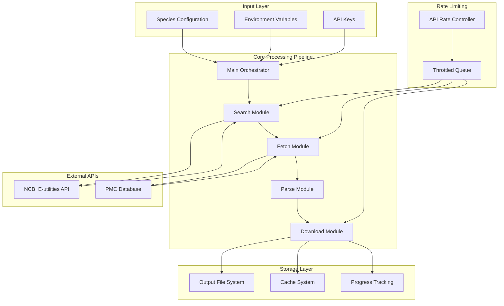
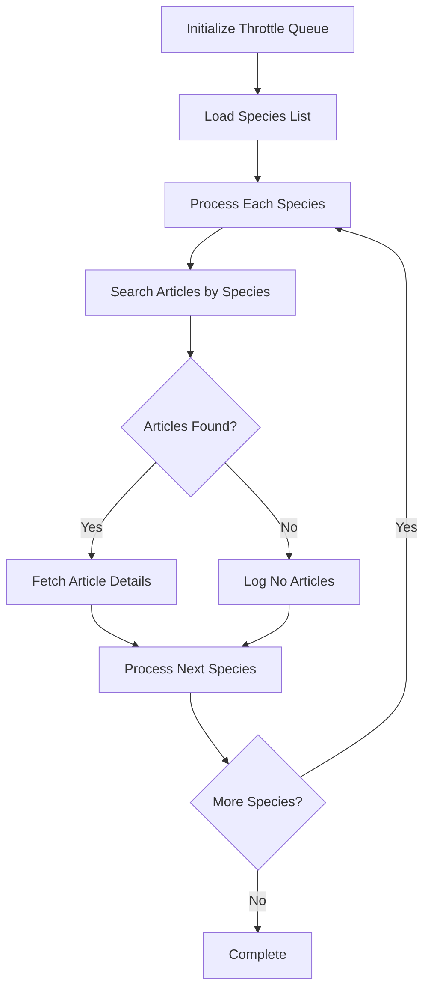
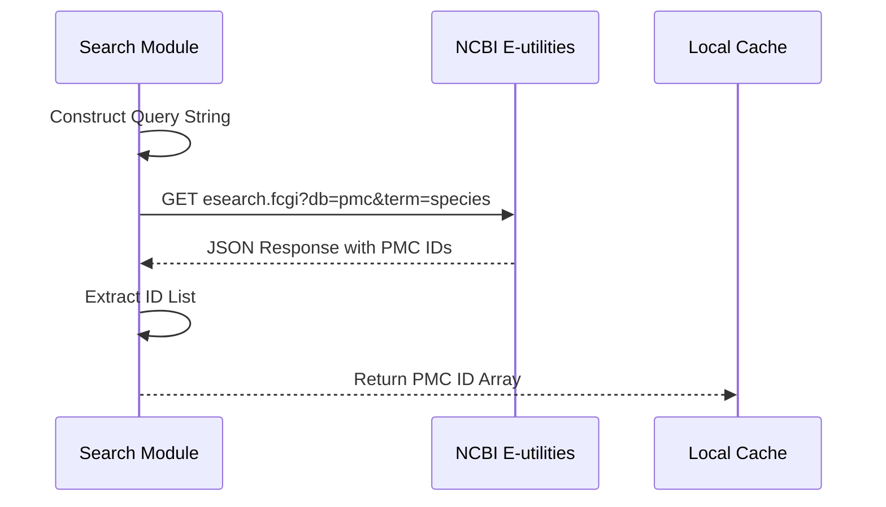
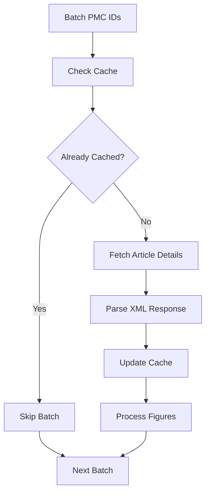
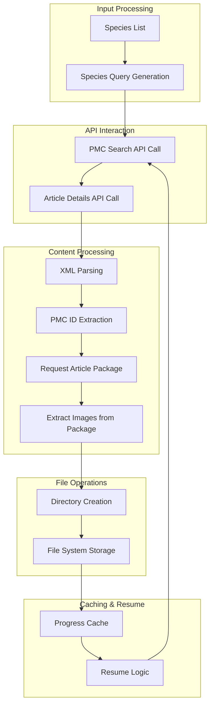
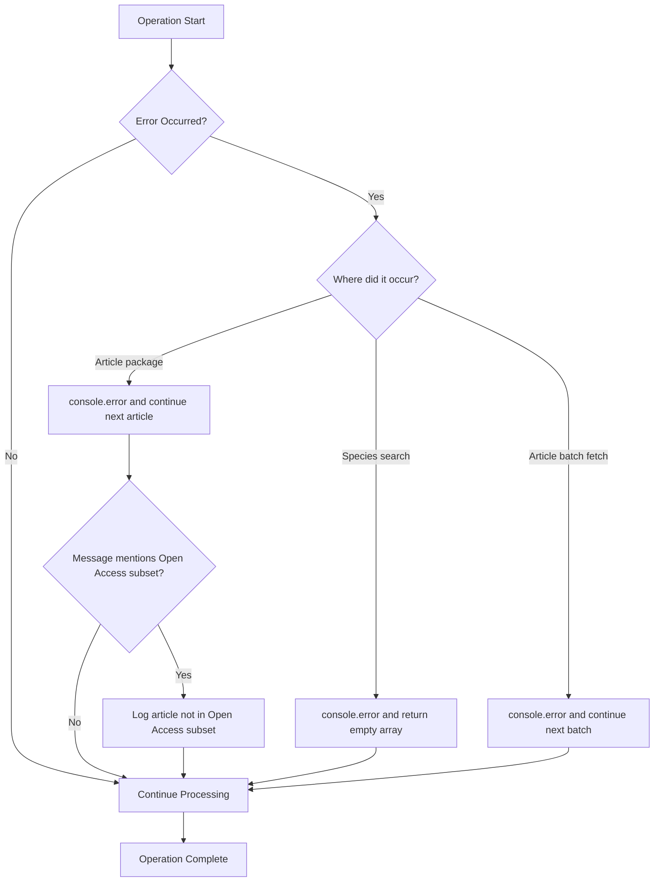
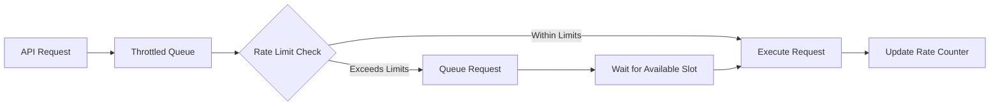
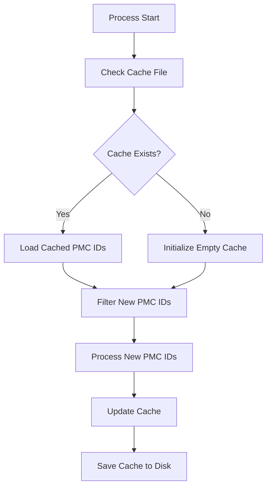
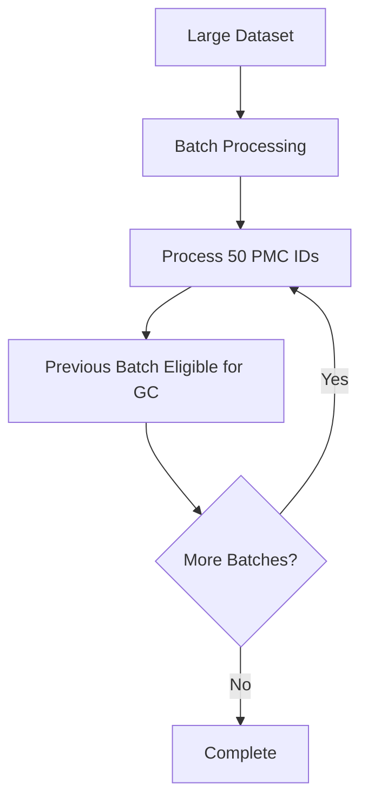

# Architecture Overview

## High-Level System Design

The Publication Figure Retrieval Tool follows a modular, pipeline-based architecture designed for scalability, maintainability, and efficient processing of scientific publications from NCBI's PMC database.

## System Architecture Diagram



## Component Architecture

### 1. Main Orchestrator (`src/index.ts`)

The central coordinator that manages the entire workflow:



**Key Responsibilities:**

- Initialize rate limiting and API configuration
- Coordinate species processing workflow
- Handle high-level error management
- Manage overall application lifecycle

### 2. Search Module (`src/processor/searchArticleBySpecies.ts`)

Handles publication discovery through NCBI's E-utilities API:



**Search Query Construction:**

```typescript
// Example query construction
const query = `${species}[organism]`;
const url = `https://eutils.ncbi.nlm.nih.gov/entrez/eutils/esearch.fcgi?db=pmc&term=${encodeURIComponent(query)}&retmode=json&retmax=1000000`;
```

For further details on the E-utilities API, refer to the [NCBI E-utilities documentation](https://www.ncbi.nlm.nih.gov/books/NBK25501/).

### 3. Fetch Module (`src/processor/fetchArticleDetails.ts`)

Retrieves detailed article metadata and content:



**Batch Processing Strategy:**

- Processes PMC IDs in batches of 50
- Implements caching to avoid redundant API calls
- Handles network errors gracefully

### 4. Parse Module (`src/processor/parseFigures.ts`)

Processes XML article data to extract PMC IDs and orchestrate package downloads:

```mermaid
graph LR
    accTitle: Parse Module Figure Extraction
    accDescr: The parse module takes XML article data, parses its structure, extracts the article metadata, locates the PMC ID, requests the article package, extracts images from the package, and saves the images to the file system.

        A[XML Article Data] --> B[Parse XML Structure]
        B --> C[Extract Article Metadata]
        C --> D[Locate PMC ID]
        D --> E[Request Article Package]
        E --> F[Extract Images from Package]
        F --> G[Save Images to File System]
```



**XML Structure Navigation (PMC ID extraction):**

The parser locates the PMC identifier in the article front matter (see implementation: [`src/processor/parseFigures.ts`](../../src/processor/parseFigures.ts)).

```xml
<pmc-articleset>
    <article>
        <front>
            <article-meta>
                <article-id pub-id-type="pmcid">PMC123456</article-id>
            </article-meta>
        </front>
    </article>
</pmc-articleset>
```

### 5. Download Module (`src/processor/downloadArticlePackage.ts`)

Downloads a complete PMC article package (.tar.gz) and extracts image files. The implementation fetches a package URL from the OA Web Service API, downloads the archive, extracts media, and selects the highest-priority image format per basename before copying results to the output directory (see implementation: [`src/processor/downloadArticlePackage.ts`](../../src/processor/downloadArticlePackage.ts)).

Key implementation behaviours (implementation proof):

- Fetches OA package metadata via the OA API and converts FTP links to HTTPS (see [`src/processor/fetchPackageUrl.ts`](../../src/processor/fetchPackageUrl.ts)).
- Downloads the package archive and extracts it to a temporary directory (see [`src/processor/downloadArticlePackage.ts`](../../src/processor/downloadArticlePackage.ts)).
- Groups files by basename and keeps the highest-priority extension using the `IMAGE_EXTENSIONS` priority map (see [`src/constants.ts`](../../src/constants.ts)).

Console-level messages written by the implementation include `Fetching package URL for <PMCID>`, `Package downloaded. Extracting images...`, `Extracted image: <filename>`, and `Successfully extracted <N> images from package.` (see [`src/processor/downloadArticlePackage.ts`](../../src/processor/downloadArticlePackage.ts)).

## Data Flow Architecture

### Primary Data Pipeline



### Error Handling Flow



## Key Architectural Principles

### 1. Separation of Concerns

Each module has a single, well-defined responsibility:

- **Search**: Publication discovery
- **Fetch**: Data retrieval
- **Parse**: Content extraction
- **Download**: File management

### 2. Rate Limiting Strategy



**Rate Limiting Implementation:**

- Uses `throttled-queue` library for precise control
- Configurable based on API key availability
- Prevents API violations and ensures sustainable usage

### 3. Caching and Resume Capability



### 4. Error Handling and Continuation

The system logs operation-level failures and continues processing subsequent species/articles:

1. **Search failures**: `searchArticlesBySpecies` returns an empty list on request failures
2. **Batch fetch failures**: `fetchArticleDetails` logs batch-level errors and continues with remaining batches
3. **Package failures**: `parseFigures` logs package-level failures and continues with remaining articles
4. **Filesystem setup**: output/cache directories are created on demand before writes

## Performance Considerations

### Memory Management



### Concurrent Operations

- **Single-threaded** design for API compliance
- **Sequential processing** to respect rate limits
- **Asynchronous I/O** for file operations

### Storage Optimization

- **Hierarchical directory structure** for organization
- **Original file format preservation**
- **Duplicate detection** through caching

## Related Documentation

- [Dependencies](./dependencies.md) - External libraries and tools used
- [Pipelines](./pipelines.md) - Detailed workflow diagrams

## Real-World Scenarios

### Large-Scale Data Collection

When processing hundreds of species with thousands of publications each:

1. **Memory**: Batch processing prevents memory overflow
2. **Network**: Rate limiting ensures API compliance
3. **Storage**: Hierarchical structure maintains organization
4. **Resume**: Cache allows recovery from interruptions

### Research Integration

The modular architecture allows easy integration with research workflows:

```typescript
// Example integration
import { fetchArticleDetails } from "./processor/fetchArticleDetails";
import { searchArticlesBySpecies } from "./processor/searchArticleBySpecies";

// Custom workflow
async function customResearchPipeline(targetSpecies: string[]) {
	for (const species of targetSpecies) {
		const pmids = await searchArticlesBySpecies(throttle, species);
		await fetchArticleDetails(throttle, pmids, species);
		// Additional custom processing...
	}
}
```

This architecture ensures the tool is both robust for production use and flexible for research customization.
