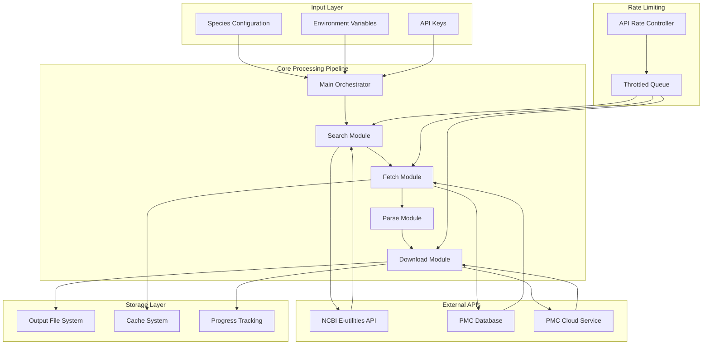
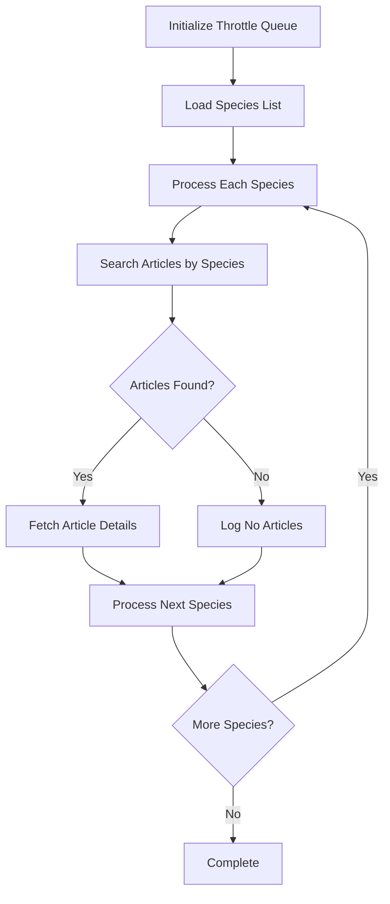
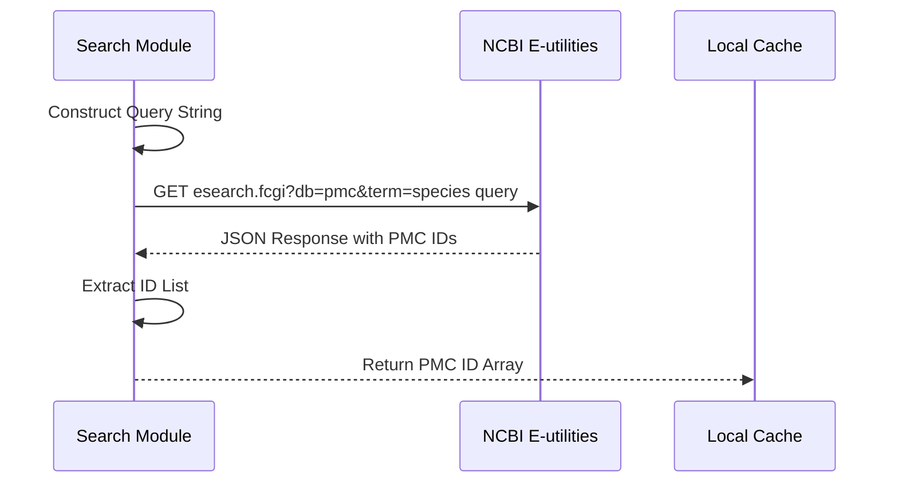
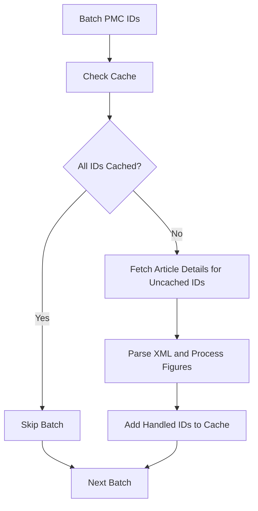
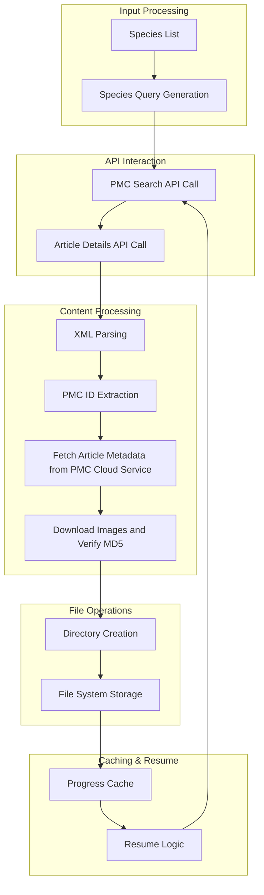
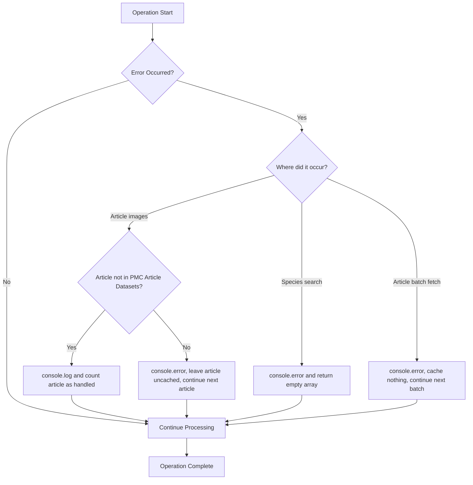
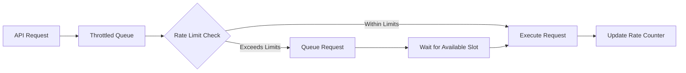
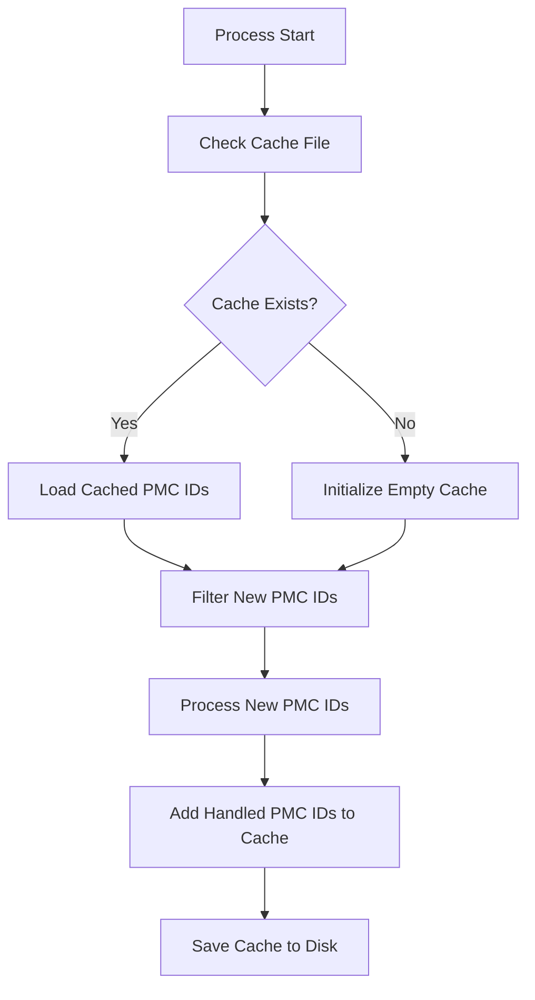
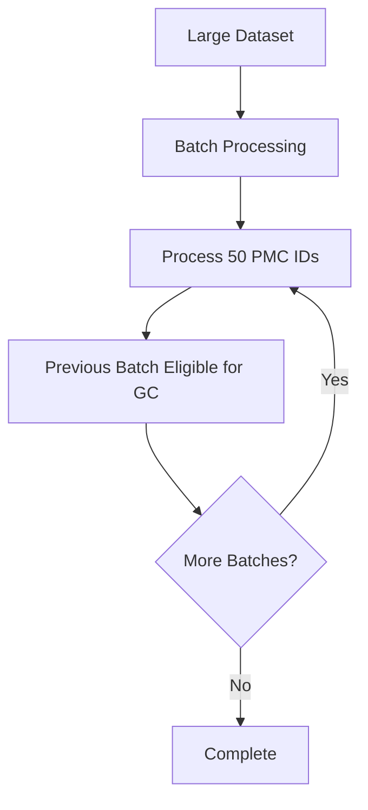

# Architecture Overview

## High-Level System Design

The Publication Figure Retrieval Tool follows a modular, pipeline-based architecture designed for scalability, maintainability, and efficient processing of scientific publications from NCBI's PMC database.

## System Architecture Diagram


```mermaid
graph TB
    accTitle: High-Level System Architecture
    accDescr: Inputs (species configuration, environment variables, and API keys) feed the main orchestrator, which drives the search, fetch, parse, and download modules. The search and fetch modules call the NCBI E-utilities API and PMC database. The download module reads article metadata and images from the PMC Cloud Service and writes verified images to the output file system and progress tracking, while the fetch module writes handled PMC IDs to the cache. A throttled queue mediates the search and fetch requests and the download module's metadata requests under an API rate controller; image downloads do not go through the queue.

    subgraph "Input Layer"
        A[Species Configuration]
        B[Environment Variables]
        C[API Keys]
    end

    subgraph "Core Processing Pipeline"
        D[Main Orchestrator]
        E[Search Module]
        F[Fetch Module]
        G[Parse Module]
        H[Download Module]
    end

    subgraph "External APIs"
        I[NCBI E-utilities API]
        J[PMC Database]
        P[PMC Cloud Service]
    end

    subgraph "Storage Layer"
        K[Output File System]
        L[Cache System]
        M[Progress Tracking]
    end

    subgraph "Rate Limiting"
        N[Throttled Queue]
        O[API Rate Controller]
    end

    A --> D
    B --> D
    C --> D

    D --> E
    E --> I
    I --> E

    E --> F
    F --> J
    J --> F

    F --> G
    G --> H
    H --> P
    P --> H

    H --> K
    F --> L
    H --> M

    N --> E
    N --> F
    N --> H
    O --> N
```

## Component Architecture

### 1. Main Orchestrator (`src/index.ts`)

The central coordinator that manages the entire workflow:


```mermaid
flowchart TD
    accTitle: Main Orchestrator Control Flow
    accDescr: The orchestrator initializes the throttle queue, loads the species list, and processes each species by searching articles. If articles are found it fetches article details, otherwise it logs that no articles were found. It then processes the next species, repeating until no species remain, at which point it completes.

    A[Initialize Throttle Queue] --> B[Load Species List]
    B --> C[Process Each Species]
    C --> D[Search Articles by Species]
    D --> E{Articles Found?}
    E -->|Yes| F[Fetch Article Details]
    E -->|No| G[Log No Articles]
    F --> H[Process Next Species]
    G --> H
    H --> I{More Species?}
    I -->|Yes| C
    I -->|No| J[Complete]
```

**Key Responsibilities:**

- Initialize rate limiting and API configuration
- Coordinate species processing workflow
- Handle high-level error management
- Manage overall application lifecycle

### 2. Search Module (`src/processor/searchArticleBySpecies.ts`)

Handles publication discovery through NCBI's E-utilities API:


```mermaid
sequenceDiagram
    accTitle: Search Module Request Sequence
    accDescr: The search module constructs a query string of the species organism term limited by the open_access or author_manuscript filters, and sends a GET request to the NCBI esearch endpoint with the PMC database and that term. The API returns a JSON response containing PMC IDs. The module extracts the ID list and returns the PMC ID array to the caller.

    participant SM as Search Module
    participant API as NCBI E-utilities
    participant Cache as Local Cache

    SM->>SM: Construct Query String
    SM->>API: GET esearch.fcgi?db=pmc&term=species query
    API-->>SM: JSON Response with PMC IDs
    SM->>SM: Extract ID List
    SM-->>Cache: Return PMC ID Array
```

**Search Query Construction:**

```typescript
// Query construction, limited to articles in the PMC Article Datasets
const query = `${species}[organism] AND (open_access[Filter] OR author_manuscript[Filter])`;
const url = `https://eutils.ncbi.nlm.nih.gov/entrez/eutils/esearch.fcgi?db=pmc&term=${encodeURIComponent(query)}&retmode=json&retmax=1000000`;
```

For further details on the E-utilities API, refer to the [NCBI E-utilities documentation](https://www.ncbi.nlm.nih.gov/books/NBK25501/).

### 3. Fetch Module (`src/processor/fetchArticleDetails.ts`)

Retrieves detailed article metadata and content:


```mermaid
graph TD
    accTitle: Fetch Module Batch Processing
    accDescr: The fetch module batches PMC IDs and checks the cache. A batch whose IDs are all cached is skipped. Otherwise the uncached IDs are fetched as article details, and the XML response is handed to parseFigures, which processes each article's figures and returns the PMC IDs it handled. Only the batch IDs that match a handled PMC ID are recorded in the cache, so failed articles are retried on the next run. Each batch leads to the next until all are handled.

    A[Batch PMC IDs] --> B[Check Cache]
    B --> C{All IDs Cached?}
    C -->|Yes| D[Skip Batch]
    C -->|No| E[Fetch Article Details for Uncached IDs]
    E --> F[Parse XML and Process Figures]
    F --> G[Add Handled IDs to Cache]
    D --> I[Next Batch]
    G --> I
```

**Batch Processing Strategy:**

- Processes PMC IDs in batches of 50
- Implements caching to avoid redundant API calls
- Caches only the IDs `parseFigures` reports as handled, so failed articles are retried on the next run
- Handles network errors gracefully

### 4. Parse Module (`src/processor/parseFigures.ts`)

Processes XML article data to extract PMC IDs and orchestrate image downloads, one article at a time:


```mermaid
graph LR
    accTitle: Parse Module Article Processing
    accDescr: The parse module takes XML article data, awaits parsing of its structure, extracts the article metadata, and locates the PMC ID of each article in turn. It calls downloadArticleImages for the article. If the images are retrieved, or the article is not in the PMC Article Datasets, the PMC ID is recorded as handled. Any other failure is logged and the article is left out. After the last article the module returns the handled PMC IDs.

        A[XML Article Data] --> B[Parse XML Structure]
        B --> C[Extract Article Metadata]
        C --> D[Locate PMC ID]
        D --> E[downloadArticleImages]
        E --> F{Outcome}
        F -->|Images retrieved| G[Record PMC ID as Handled]
        F -->|Not in PMC Article Datasets| G
        F -->|Other failure| H[Log Error and Leave Out]
        G --> I[Return Handled PMC IDs]
        H --> I
```

**XML Structure Navigation (PMC ID extraction):**

The parser locates the PMC identifier in the article front matter (see implementation: [`src/processor/parseFigures.ts`](../../src/processor/parseFigures.ts)).

```xml
<pmc-articleset>
    <article>
        <front>
            <article-meta>
                <article-id pub-id-type="pmcid">PMC123456</article-id>
            </article-meta>
        </front>
    </article>
</pmc-articleset>
```

### 5. Download Module (`src/processor/downloadArticleImages.ts`)

Downloads an article's figure images as individual files from the PMC Cloud Service, the public S3 bucket `pmc-oa-opendata` that holds the PMC Article Datasets (see [`src/constants.ts`](../../src/constants.ts)). NLM announced that from August 2026 the PMC Cloud Service is the primary source for PMC Article Datasets files: the PMC OA Web Service API is no longer available, the PMC Article Datasets files are removed from the PMC FTP Service, and the new structure has no compressed packages (see the [NLM Technical Bulletin](https://www.nlm.nih.gov/pubs/techbull/jf26/jf26_Changes_to_PMC_ArtDsDistribServs_2026.html), the [PMC OA Web Service page](https://pmc.ncbi.nlm.nih.gov/tools/oa-service/), and the [PMC Cloud Service documentation](https://pmc.ncbi.nlm.nih.gov/tools/pmcaws/)).

Key implementation behaviours (implementation proof):

- Rejects a PMC ID that is not `PMC` followed by digits, or digits alone, before using it in a file path (see [`src/processor/downloadArticleImages.ts`](../../src/processor/downloadArticleImages.ts)).
- Fetches the metadata of the highest-numbered article version through the throttle: the bucket is listed under the `<PMCID>.` prefix and `metadata/<PMCID>.<version>.json` is read. An article with no version raises `ArticleNotInDatasetError` (see [`src/processor/fetchArticleMetadata.ts`](../../src/processor/fetchArticleMetadata.ts)).
- Selects image media URLs under the article version's own `<PMCID>.<version>/` prefix and keeps one file per figure basename using the `IMAGE_EXTENSIONS` priority map (see [`src/constants.ts`](../../src/constants.ts)).
- Downloads each selected image one at a time, outside the throttle, and checks it against the MD5 digest in the media URL's `md5` query parameter. Only verified images are written, and the output directory is created when the first one is written (see [`src/processor/downloadArticleImages.ts`](../../src/processor/downloadArticleImages.ts)).
- Throws `<n> of <m> images failed for <PMCID>` if any image fails to download or verify; images already verified stay on disk.

Console-level messages written by the implementation include `Fetching metadata for <PMCID>...`, `Downloaded image: <filename>`, `No images found for <PMCID>.`, and `Successfully downloaded <N> images for <PMCID>.` (see [`src/processor/downloadArticleImages.ts`](../../src/processor/downloadArticleImages.ts)).

## Data Flow Architecture

### Primary Data Pipeline


```mermaid
graph TD
    accTitle: Primary Data Pipeline
    accDescr: The species list generates species queries that drive the PMC search and article-detail API calls. Responses are parsed from XML, the PMC ID is extracted, the article metadata is fetched from the PMC Cloud Service, and each selected image is downloaded and checked against its MD5 digest. The output directory is created on the first verified image and images are written to the file system. A progress cache records handled articles, and resume logic skips already-processed PMC IDs when fetching article details.

    subgraph "Input Processing"
        A[Species List] --> B[Species Query Generation]
    end

    subgraph "API Interaction"
        B --> C[PMC Search API Call]
        C --> D[Article Details API Call]
    end

    subgraph "Content Processing"
        D --> E[XML Parsing]
        E --> F[PMC ID Extraction]
        F --> G[Fetch Article Metadata from PMC Cloud Service]
        G --> H[Download Images and Verify MD5]
    end

    subgraph "File Operations"
        H --> I[Directory Creation]
        I --> J[File System Storage]
    end

    subgraph "Caching & Resume"
        K[Progress Cache] --> L[Resume Logic]
        J --> K
        L --> C
    end
```

### Error Handling Flow


```mermaid
graph TD
    accTitle: Error Handling and Continuation Flow
    accDescr: When an operation runs, the tool checks whether an error occurred. If not, processing continues. If an error occurs, the tool classifies where it happened. A species search error is logged with console.error and returns an empty array. An article batch fetch error is logged, nothing from the batch is cached, and processing continues with the next batch. When an article's images cannot be retrieved, the tool checks whether the article is missing from the PMC Article Datasets. If it is, the tool logs that with console.log and counts the article as handled so it is cached. Any other article error is logged with console.error, the article is left out of the cache, and processing continues with the next article. The tool does not retry or apply backoff within a run; uncached articles are retried on the next run.

    A[Operation Start] --> B{Error Occurred?}
    B -->|No| C[Continue Processing]
    B -->|Yes| D{Where did it occur?}
    D -->|Species search| E[console.error and return empty array]
    D -->|Article batch fetch| F[console.error, cache nothing, continue next batch]
    D -->|Article images| G{Article not in PMC Article Datasets?}
    G -->|Yes| H[console.log and count article as handled]
    G -->|No| I[console.error, leave article uncached, continue next article]
    H --> C
    I --> C
    E --> C
    F --> C
    C --> J[Operation Complete]
```

## Key Architectural Principles

### 1. Separation of Concerns

Each module has a single, well-defined responsibility:

- **Search**: Publication discovery
- **Fetch**: Data retrieval
- **Parse**: Content extraction
- **Download**: File management

### 2. Rate Limiting Strategy


```mermaid
graph LR
    accTitle: Rate Limiting Strategy
    accDescr: An API request enters the throttled queue, which checks the rate limit. Requests within the limit execute immediately, while requests that exceed it are queued until a slot is available and then executed. Each executed request updates the rate counter.

    A[API Request] --> B[Throttled Queue]
    B --> C{Rate Limit Check}
    C -->|Within Limits| D[Execute Request]
    C -->|Exceeds Limits| E[Queue Request]
    E --> F[Wait for Available Slot]
    F --> D
    D --> G[Update Rate Counter]
```

**Rate Limiting Implementation:**

- Uses `throttled-queue` library for precise control
- Configurable based on API key availability
- Prevents API violations and ensures sustainable usage
- Applies to ESearch and EFetch requests and to each article's metadata lookup on the PMC Cloud Service, where the bucket listing and the metadata request share one throttled call; image downloads do not go through the queue

### 3. Caching and Resume Capability


```mermaid
graph TB
    accTitle: Caching and Resume Capability
    accDescr: At process start the tool checks for the cache file. If it exists, the cached PMC IDs are loaded; if not, an empty cache is initialized. New PMC IDs are filtered from the cache and processed, then only the IDs of handled articles are added to the cache, which is saved to disk. Articles that failed stay uncached and are retried on the next run.

    A[Process Start] --> B[Check Cache File]
    B --> C{Cache Exists?}
    C -->|Yes| D[Load Cached PMC IDs]
    C -->|No| E[Initialize Empty Cache]
    D --> F[Filter New PMC IDs]
    E --> F
    F --> G[Process New PMC IDs]
    G --> H[Add Handled PMC IDs to Cache]
    H --> I[Save Cache to Disk]
```

### 4. Error Handling and Continuation

The system logs operation-level failures and continues processing subsequent species/articles:

1. **Search failures**: `searchArticlesBySpecies` returns an empty list on request failures
2. **Batch fetch failures**: `fetchArticleDetails` logs batch-level errors and continues with remaining batches
3. **Article failures**: `parseFigures` logs article-level failures, leaves those articles out of the IDs it returns so they are not cached, and continues with remaining articles. An article that is not in the PMC Article Datasets is logged and counted as handled.
4. **Image failures**: `downloadArticleImages` logs each image that fails to download or verify, continues with the remaining images, and then throws so the article is retried on the next run
5. **Filesystem setup**: the cache directory is created when the cache file is missing, and an article's output directory is created when its first verified image is written

## Performance Considerations

### Memory Management


```mermaid
graph TD
    accTitle: Memory Management Through Batching
    accDescr: A large dataset is handled through batch processing. The tool processes 50 PMC IDs at a time, so only one batch is held in memory at once and the previous batch becomes eligible for garbage collection, repeating until no batches remain.

    A[Large Dataset] --> B[Batch Processing]
    B --> C[Process 50 PMC IDs]
    C --> D[Previous Batch Eligible for GC]
    D --> E{More Batches?}
    E -->|Yes| C
    E -->|No| F[Complete]
```

### Concurrent Operations

- **Single-threaded** design for API compliance
- **Sequential processing** to respect rate limits: articles are processed one at a time, and each article's images are downloaded one at a time
- **Synchronous file writes** for images and the cache file

### Storage Optimization

- **Hierarchical directory structure** for organization
- **Original file format preservation**
- **Duplicate detection** through caching

## Related Documentation

- [Dependencies](./dependencies.md) - External libraries and tools used
- [Pipelines](./pipelines.md) - Detailed workflow diagrams

## Real-World Scenarios

### Large-Scale Data Collection

When processing hundreds of species with thousands of publications each:

1. **Memory**: Batch processing prevents memory overflow
2. **Network**: Rate limiting ensures API compliance
3. **Storage**: Hierarchical structure maintains organization
4. **Resume**: Cache allows recovery from interruptions

### Research Integration

The modular architecture allows easy integration with research workflows:

```typescript
// Example integration
import { fetchArticleDetails } from "./processor/fetchArticleDetails";
import { searchArticlesBySpecies } from "./processor/searchArticleBySpecies";

// Custom workflow
async function customResearchPipeline(targetSpecies: string[]) {
	for (const species of targetSpecies) {
		const pmids = await searchArticlesBySpecies(throttle, species);
		await fetchArticleDetails(throttle, pmids, species);
		// Additional custom processing...
	}
}
```

This architecture ensures the tool is both robust for production use and flexible for research customization.
