# Pipelines and Workflows

## Data Processing Pipeline

This document provides detailed workflow diagrams and explanations of the data processing pipelines used in the Publication Figure Retrieval Tool.

## Main Processing Pipeline

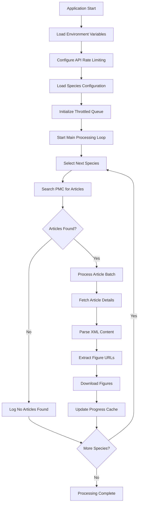

## Species Processing Workflow

### Step 1: Species Search Pipeline

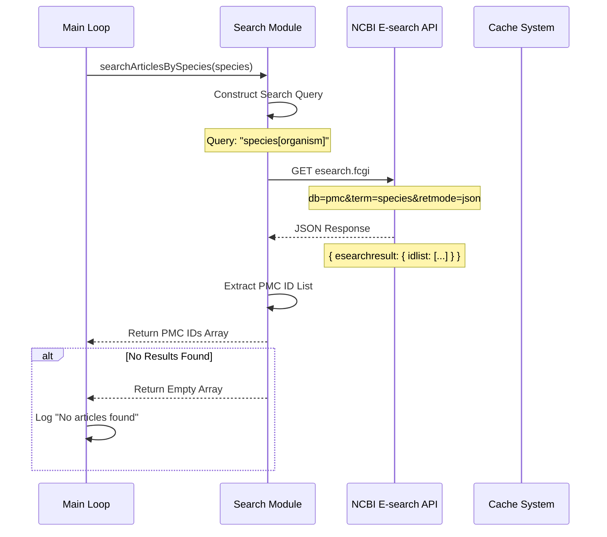

### Step 2: Article Detail Fetching Pipeline

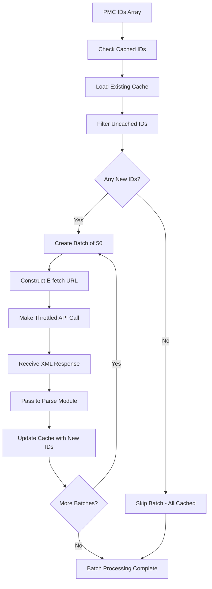

### Step 3: XML Parsing and Figure Extraction

```mermaid
graph LR
    subgraph "XML Processing"
        A[Raw XML Data] --> B[xml2js Parser]
        B --> C[JavaScript Object]
    end

    subgraph "Article Processing"
        C --> D[Extract Article Array]
        D --> E[For Each Article]
        E --> F[Get PMC ID]
        F --> G[Extract Figure Elements]
    end

    subgraph "Figure Processing"
        G --> H[Process Figure Graphics]
        H --> I[Construct Figure URLs]
        I --> J[Validate URL Format]
        J --> K[Add .jpg if No Extension]
    end

    subgraph "Download Orchestration"
        K --> L[Create Output Directory]
        L --> M[Queue Figure Download]
        M --> N[Update Progress]
    end
```

## Figure Download Pipeline

### Download State Machine

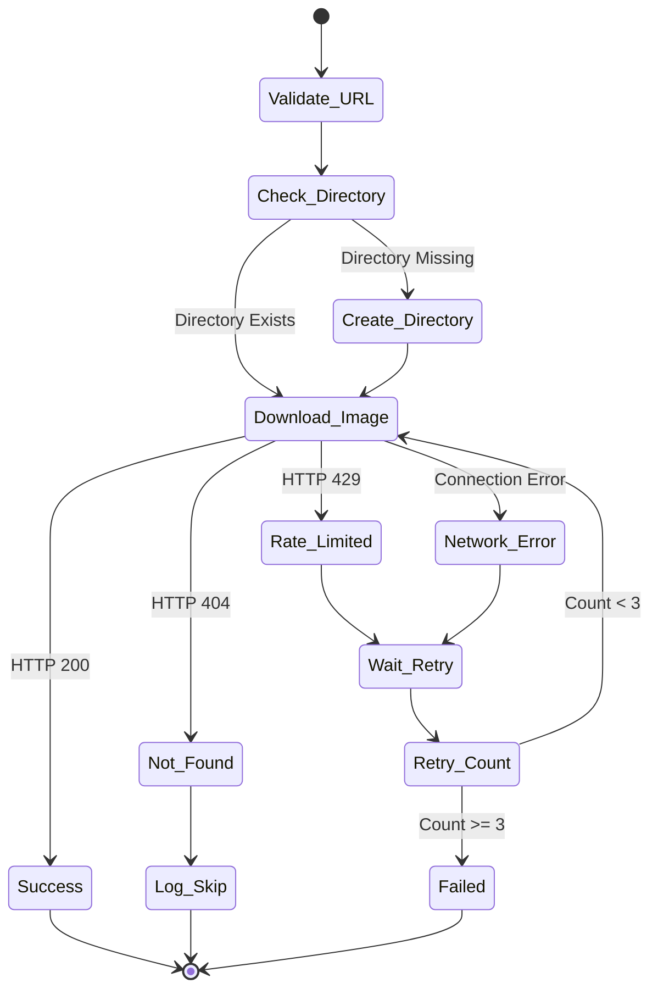

### Parallel Download Management

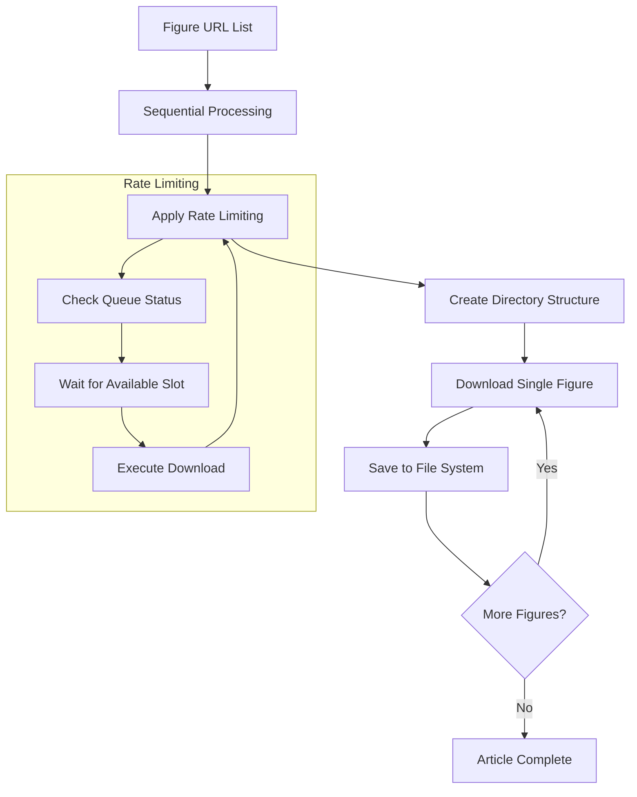

## Error Handling Pipeline

### Error Recovery Workflow

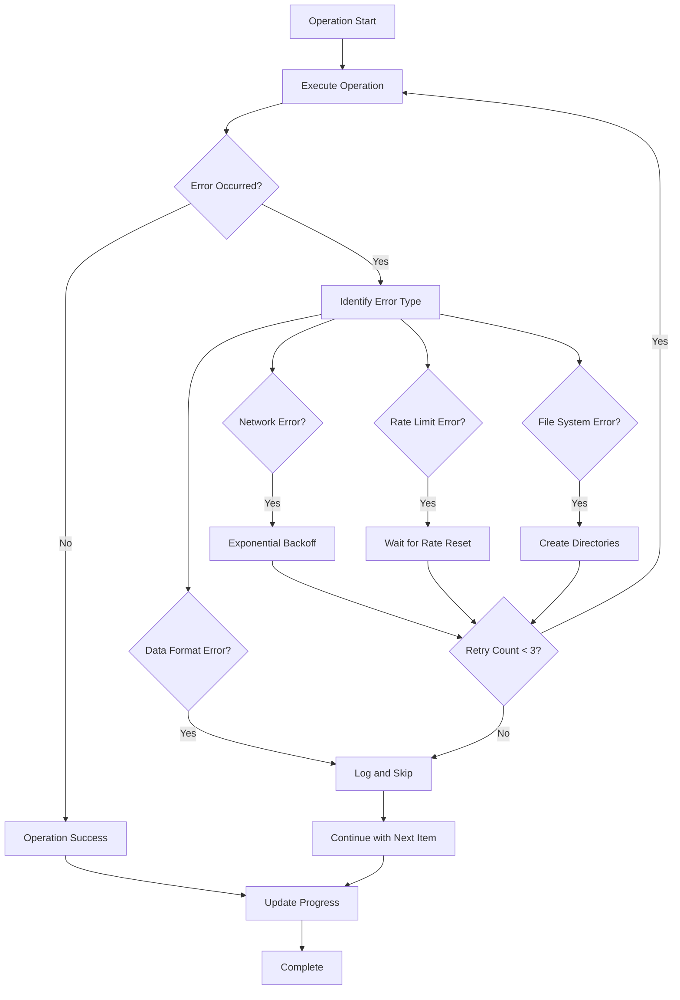

## Cache Management Pipeline

### Cache Read/Write Workflow

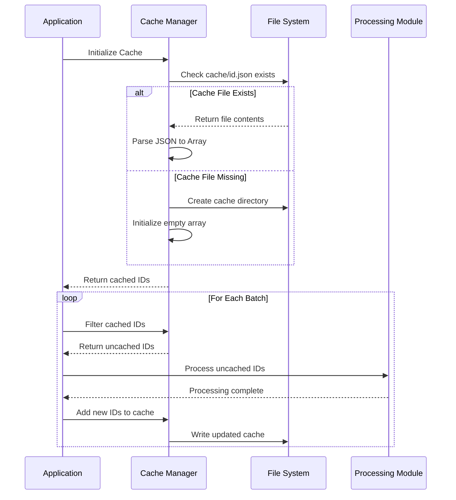

### Cache Structure

```json
{
	"cached_ids": ["PMC123456", "PMC789012", "PMC345678"],
	"last_updated": "2024-01-15T10:30:00Z",
	"species_processed": ["Arabidopsis_thaliana", "Cannabis_sativa"]
}
```

## Performance Optimization Pipeline

### Batch Processing Strategy

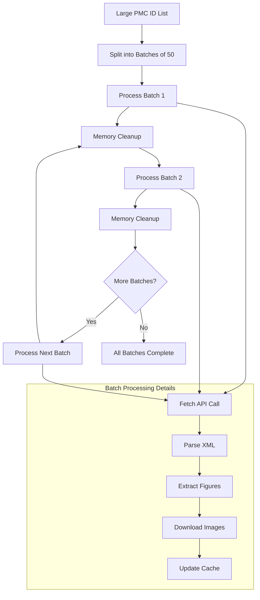

## Rate Limiting Pipeline

### Throttling Implementation

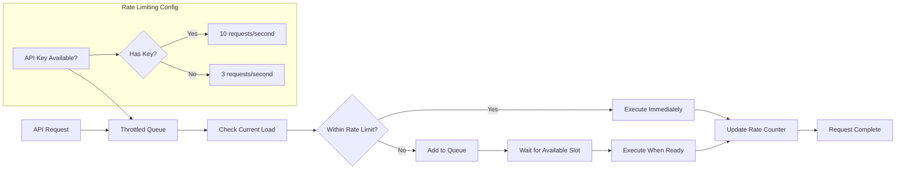

## Monitoring and Logging Pipeline

### Progress Tracking

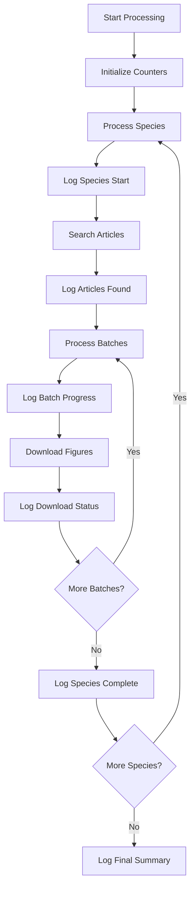

### Example Log Output Flow

```bash
[INFO] Searching articles for the species: Arabidopsis_thaliana...
[INFO] Found 1,234 articles for Arabidopsis_thaliana
[INFO] Fetching Arabidopsis thaliana article details for batch 1-50...
[INFO] Processing article PMC ID: PMC123456
[INFO] Found 3 figures in the article.
[INFO] Downloaded image: figure1.jpg
[INFO] Downloaded image: figure2.png
[INFO] Downloaded image: supplementary1.tiff
[INFO] All IDs in Arabidopsis thaliana batch 51-100 are already cached.
[INFO] Processing complete for Arabidopsis_thaliana
```

## Resume and Recovery Pipeline

### Interrupted Process Recovery

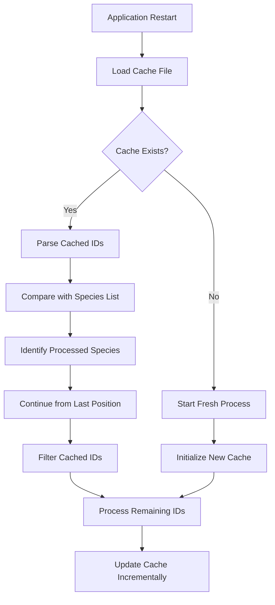

This pipeline architecture ensures robust, efficient, and resumable processing of scientific publication figures while respecting external API constraints and providing clear progress tracking throughout the entire workflow.
