# Pipelines and Workflows

## Data Processing Pipeline

This document provides detailed workflow diagrams and explanations of the data processing pipelines used in the Publication Figure Retrieval Tool.

## Main Processing Pipeline

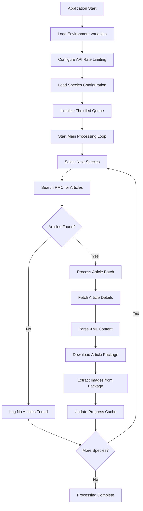

## Species Processing Workflow

### Step 1: Species Search Pipeline

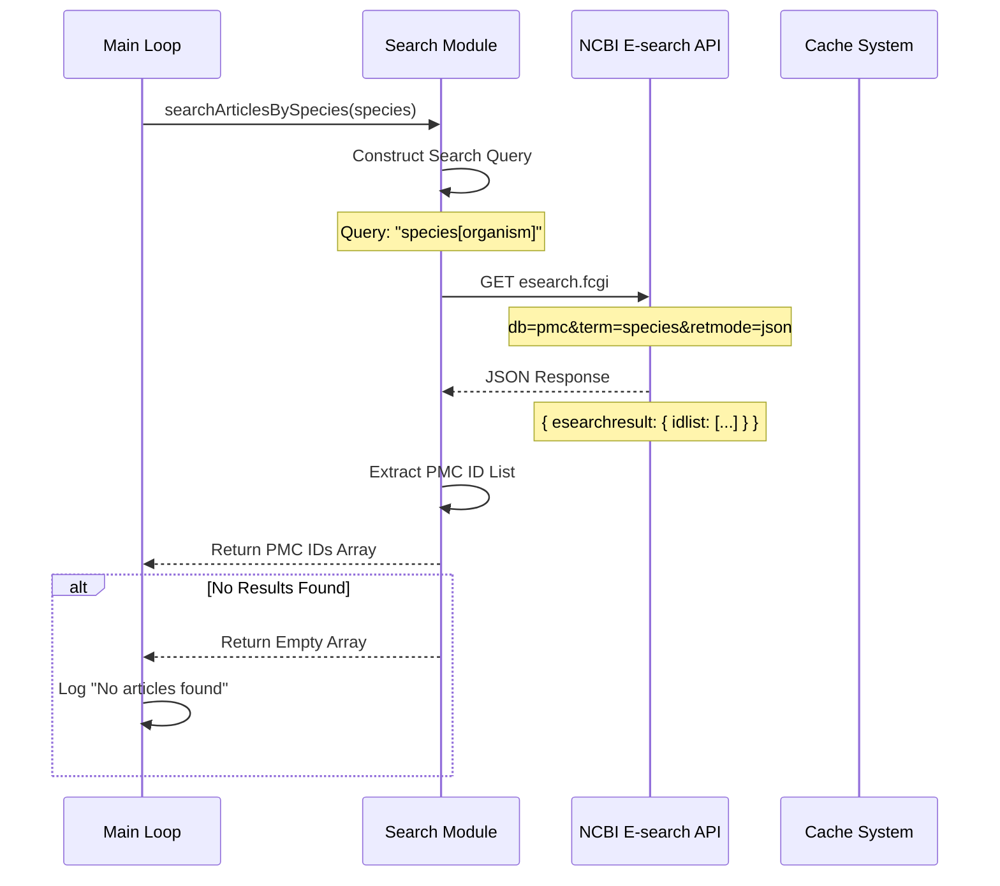

### Step 2: Article Detail Fetching Pipeline

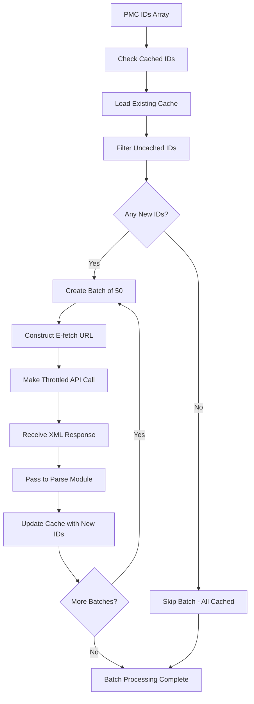

### Step 3: XML Parsing and Package Extraction

```mermaid
graph LR
    accTitle: XML Parsing and Package Extraction
    accDescr: Raw XML data is parsed by xml2js into a JavaScript object. The tool extracts the article array and, for each article, gets the PMC ID. It then resolves the OA package URL, downloads the .tar.gz package, extracts the contents, and selects the highest-priority image per basename. Finally it creates the output directory, copies the selected images, and updates progress.

    subgraph "XML Processing"
        A[Raw XML Data] --> B[xml2js Parser]
        B --> C[JavaScript Object]
    end

    subgraph "Article Processing"
        C --> D[Extract Article Array]
        D --> E[For Each Article]
        E --> F[Get PMC ID]
        F --> G[Extract Figure Elements]
    end

    subgraph "Article Package Processing"
        G --> H[Resolve OA Package URL]
        H --> I[Download .tar.gz Package]
        I --> J[Extract Package Contents]
        J --> K[Select Highest-Priority Image Per Basename]
    end

    subgraph "Download Orchestration"
        K --> L[Create Output Directory]
        L --> M[Copy Selected Images]
        M --> N[Update Progress]
    end
```

## Figure Download Pipeline

### Download State Machine

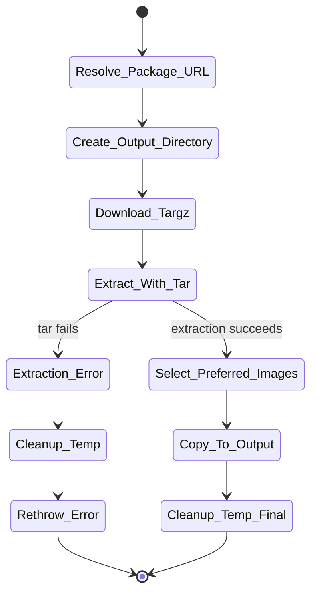

### Package Download Management

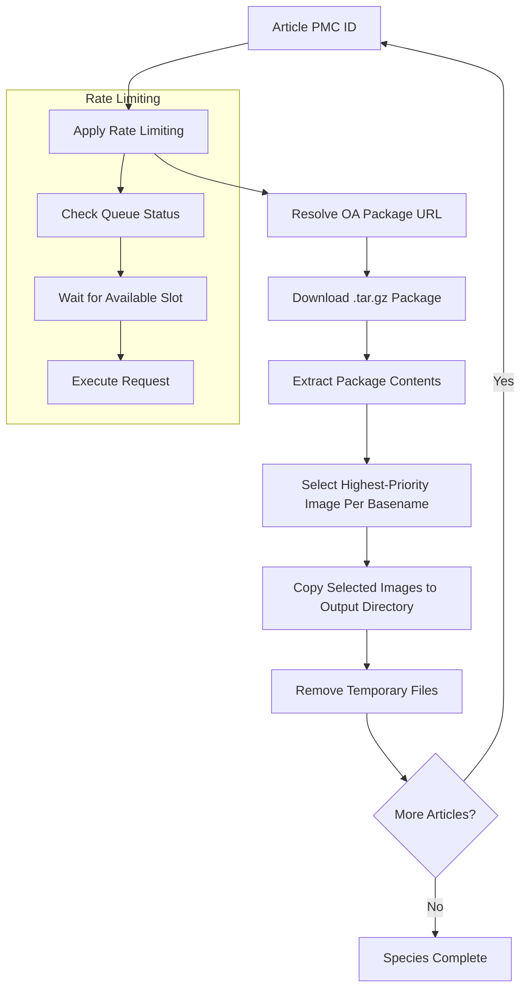

## Error Handling Pipeline

### Error Recovery Workflow

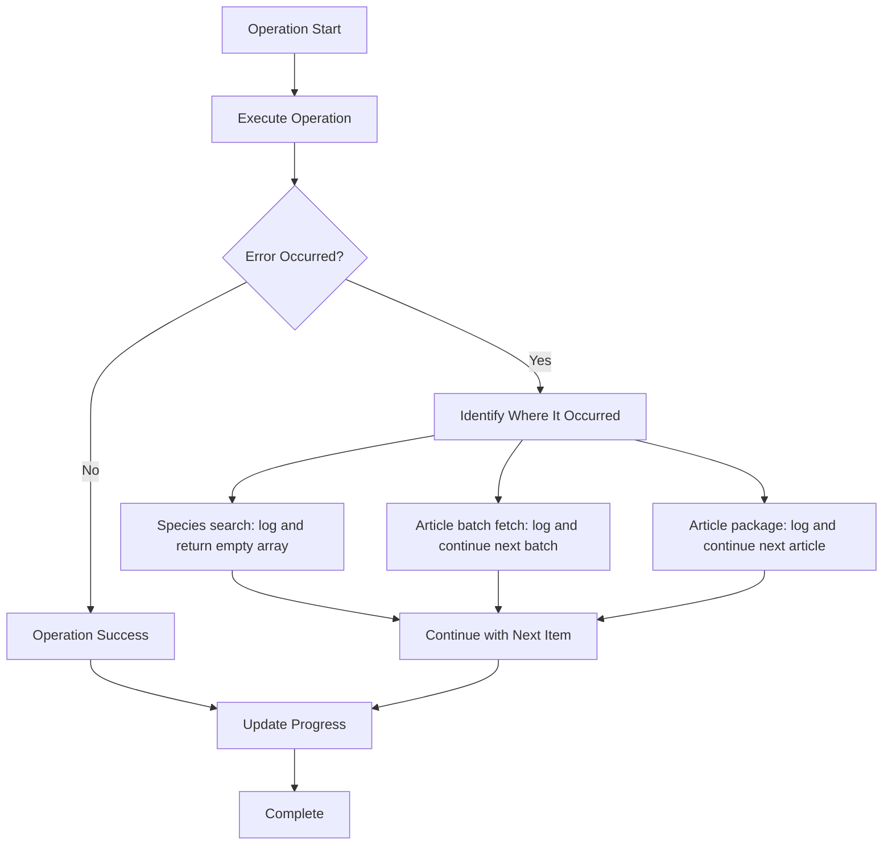

## Cache Management Pipeline

### Cache Read/Write Workflow

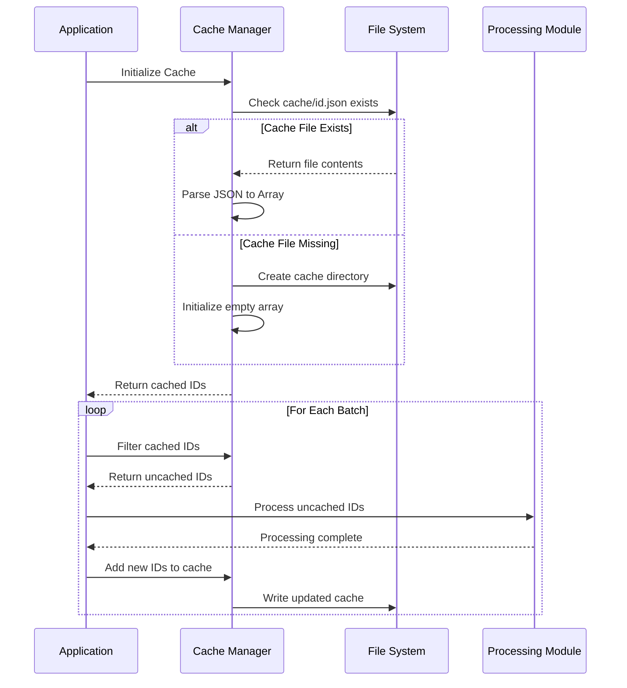

### Cache Structure

```json
["PMC123456", "PMC789012", "PMC345678"]
```

## Performance Optimization Pipeline

### Batch Processing Strategy

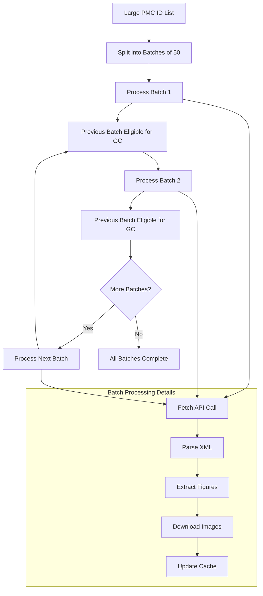

## Rate Limiting Pipeline

### Throttling Implementation

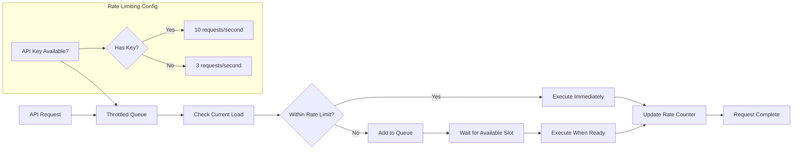

## Monitoring and Logging Pipeline

### Progress Tracking

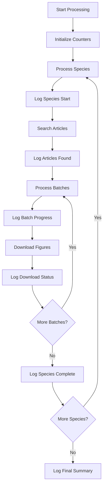

### Example Log Output Flow

```bash
Searching articles for the species: Arabidopsis_thaliana...
Fetching Arabidopsis thaliana article details for batch 1-50...
Processing article PMC ID: PMC123456
Fetching package URL for PMC123456...
Downloading package from https://.../PMC123456.tar.gz...
Package downloaded. Extracting images...
Extracted image: figure1.jpg (priority: jpg)
Successfully extracted 1 images from package.
Successfully processed article package for PMC123456
All IDs in Arabidopsis thaliana batch 51-100 are already cached.
```

## Resume and Recovery Pipeline

### Interrupted Process Recovery

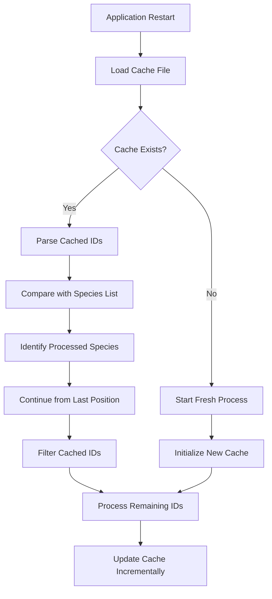

This pipeline architecture ensures robust, efficient, and resumable processing of scientific publication figures while respecting external API constraints and providing clear progress tracking throughout the entire workflow.
