# Pipelines and Workflows

## Data Processing Pipeline

This document provides detailed workflow diagrams and explanations of the data processing pipelines used in the Publication Figure Retrieval Tool.

## Main Processing Pipeline

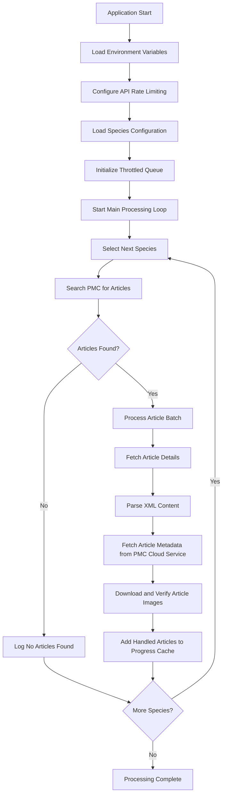
```mermaid
graph TD
    accTitle: Main Processing Pipeline
    accDescr: The application starts, loads environment variables, configures API rate limiting, loads the species configuration, and initializes the throttled queue. It then loops over species, searching PMC for articles. If no articles are found it logs that and moves on; otherwise it fetches article details, parses the XML, fetches each article's metadata from the PMC Cloud Service, downloads and verifies the article's images, and adds the handled articles to the progress cache. The loop continues until no species remain.

    A[Application Start] --> B[Load Environment Variables]
    B --> C[Configure API Rate Limiting]
    C --> D[Load Species Configuration]
    D --> E[Initialize Throttled Queue]
    E --> F[Start Main Processing Loop]

    F --> G[Select Next Species]
    G --> H[Search PMC for Articles]
    H --> I{Articles Found?}

    I -->|No| J[Log No Articles Found]
    I -->|Yes| K[Process Article Batch]

    J --> L{More Species?}
    K --> M[Fetch Article Details]
    M --> N[Parse XML Content]
    N --> O[Fetch Article Metadata from PMC Cloud Service]
    O --> P[Download and Verify Article Images]
    P --> Q[Add Handled Articles to Progress Cache]
    Q --> L

    L -->|Yes| G
    L -->|No| R[Processing Complete]
```

## Species Processing Workflow

### Step 1: Species Search Pipeline

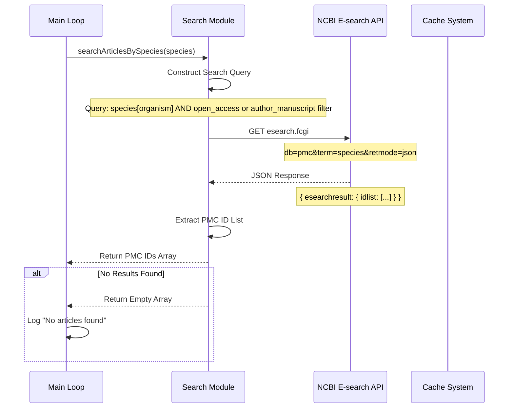
```mermaid
sequenceDiagram
    accTitle: Species Search Pipeline
    accDescr: The main loop calls the search module with a species name. The module constructs a query of the form species[organism] AND (open_access[Filter] OR author_manuscript[Filter]), which limits results to articles in the PMC Article Datasets, and sends a GET request to the NCBI esearch endpoint. The API returns a JSON response whose esearchresult.idlist holds the PMC IDs, which the module returns to the main loop. When no results are found it returns an empty array and the main loop logs that no articles were found.

    participant M as Main Loop
    participant S as Search Module
    participant API as NCBI E-search API
    participant C as Cache System

    M->>S: searchArticlesBySpecies(species)
    S->>S: Construct Search Query
    Note over S: Query: species[organism] AND open_access or author_manuscript filter
    S->>API: GET esearch.fcgi
    Note over API: db=pmc&term=species&retmode=json

    API-->>S: JSON Response
    Note over API: { esearchresult: { idlist: [...] } }
    S->>S: Extract PMC ID List
    S-->>M: Return PMC IDs Array

    alt No Results Found
        S-->>M: Return Empty Array
        M->>M: Log "No articles found"
    end
```

### Step 2: Article Detail Fetching Pipeline

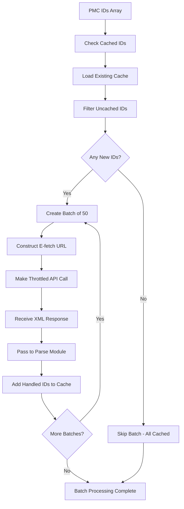
```mermaid
graph TD
    accTitle: Article Detail Fetching Pipeline
    accDescr: The PMC IDs array is filtered against cached IDs loaded from disk. If a batch has no new IDs it is skipped as already cached. Otherwise the tool builds a batch of 50, constructs the efetch URL, makes a throttled API call, receives the XML response, passes it to the parse module, and adds to the cache only the IDs of the articles the parse module reports as handled, so failed articles are retried on the next run. Processing continues until all batches are handled.

    A[PMC IDs Array] --> B[Check Cached IDs]
    B --> C[Load Existing Cache]
    C --> D[Filter Uncached IDs]
    D --> E{Any New IDs?}

    E -->|No| F[Skip Batch - All Cached]
    E -->|Yes| G[Create Batch of 50]

    G --> H[Construct E-fetch URL]
    H --> I[Make Throttled API Call]
    I --> J[Receive XML Response]
    J --> K[Pass to Parse Module]
    K --> L[Add Handled IDs to Cache]
    L --> M{More Batches?}

    M -->|Yes| G
    M -->|No| N[Batch Processing Complete]
    F --> N
```

### Step 3: XML Parsing and Image Download


```mermaid
graph LR
    accTitle: XML Parsing and Image Download
    accDescr: Raw XML data is parsed by xml2js into a JavaScript object, and parsing is awaited. The tool extracts the article array and handles one article at a time, getting its PMC ID. It lists the PMC Cloud Service bucket under the PMC ID prefix, picks the highest-numbered article version, and fetches that version's metadata JSON. From the metadata media URLs it selects the images under the version's own prefix, keeping the highest-priority extension per figure. It downloads each image, verifies its MD5 digest, creates the output directory on the first verified image, and writes the verified images. Finally the PMC ID is reported as handled so the caller can cache it.

    subgraph "XML Processing"
        A[Raw XML Data] --> B[xml2js Parser]
        B --> C[JavaScript Object]
    end

    subgraph "Article Processing"
        C --> D[Extract Article Array]
        D --> E[For Each Article]
        E --> F[Get PMC ID]
    end

    subgraph "PMC Cloud Service Metadata"
        F --> G[List Bucket Under PMCID Prefix]
        G --> H[Pick Highest Article Version]
        H --> I[Fetch Version Metadata JSON]
        I --> J[Select Highest-Priority Image Per Figure]
    end

    subgraph "Download Orchestration"
        J --> K[Download Each Image]
        K --> L[Verify MD5 Digest]
        L --> M[Create Output Directory on First Write and Write Image]
        M --> N[Report PMC ID as Handled]
    end
```

## Figure Download Pipeline

### Download State Machine

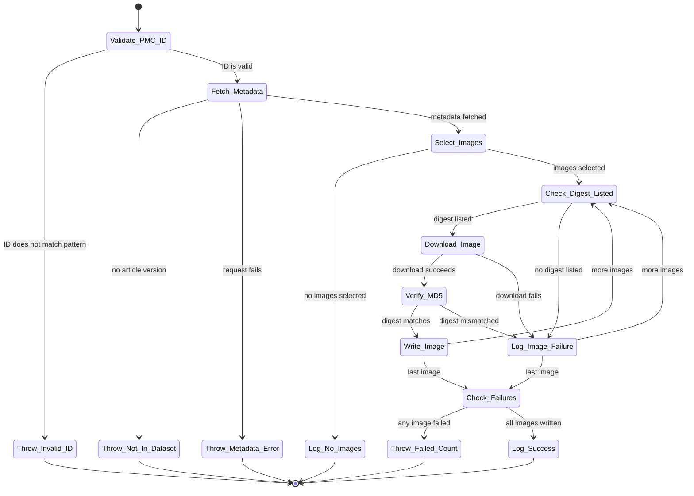
```mermaid
stateDiagram-v2
    accTitle: Article Image Download States
    accDescr: For each article the tool first validates the PMC ID and throws an error if it is not PMC followed by digits, or digits alone. It then fetches the article metadata through the throttle. If the article has no version in the PMC Article Datasets it throws ArticleNotInDatasetError, and if a request to the bucket fails it throws an error. With metadata in hand it selects images; if none are selected it logs that no images were found and finishes. Otherwise, for each image in turn, it first checks that the metadata lists an MD5 digest for it; an image without one is not downloaded. It then downloads the image and verifies its MD5 digest. A verified image is written to the output directory, which is created on the first write. A missing digest, a failed download, or a digest mismatch is logged and the tool moves on to the next image. After the last image, the tool throws an error naming how many images failed if any did; otherwise it logs success and finishes. There is no per-image retry within a run.

    [*] --> Validate_PMC_ID
    Validate_PMC_ID --> Throw_Invalid_ID : ID does not match pattern
    Throw_Invalid_ID --> [*]
    Validate_PMC_ID --> Fetch_Metadata : ID is valid

    Fetch_Metadata --> Throw_Not_In_Dataset : no article version
    Throw_Not_In_Dataset --> [*]
    Fetch_Metadata --> Throw_Metadata_Error : request fails
    Throw_Metadata_Error --> [*]
    Fetch_Metadata --> Select_Images : metadata fetched

    Select_Images --> Log_No_Images : no images selected
    Log_No_Images --> [*]
    Select_Images --> Check_Digest_Listed : images selected

    Check_Digest_Listed --> Download_Image : digest listed
    Check_Digest_Listed --> Log_Image_Failure : no digest listed
    Download_Image --> Verify_MD5 : download succeeds
    Download_Image --> Log_Image_Failure : download fails
    Verify_MD5 --> Write_Image : digest matches
    Verify_MD5 --> Log_Image_Failure : digest mismatched
    Write_Image --> Check_Digest_Listed : more images
    Log_Image_Failure --> Check_Digest_Listed : more images
    Write_Image --> Check_Failures : last image
    Log_Image_Failure --> Check_Failures : last image

    Check_Failures --> Throw_Failed_Count : any image failed
    Throw_Failed_Count --> [*]
    Check_Failures --> Log_Success : all images written
    Log_Success --> [*]
```

### Image Download Management

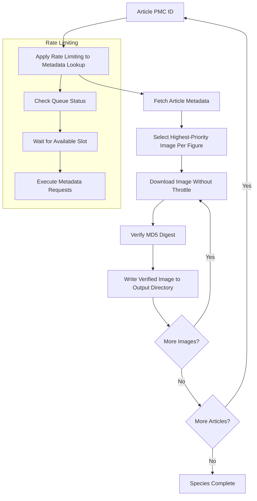
```mermaid
graph TD
    accTitle: Article Image Download Management
    accDescr: For each article PMC ID the tool applies rate limiting through the throttled queue to the metadata lookup only, fetches the article metadata from the PMC Cloud Service, and selects the highest-priority image per figure. It then downloads each image without the throttled queue, verifies its MD5 digest, and writes verified images to the output directory, repeating until no images remain. Articles, and the images within each article, are processed sequentially rather than in parallel.

    A[Article PMC ID] --> B[Apply Rate Limiting to Metadata Lookup]
    B --> C[Fetch Article Metadata]
    C --> D[Select Highest-Priority Image Per Figure]
    D --> E[Download Image Without Throttle]
    E --> F[Verify MD5 Digest]
    F --> G[Write Verified Image to Output Directory]
    G --> H{More Images?}
    H -->|Yes| E
    H -->|No| I{More Articles?}
    I -->|Yes| A
    I -->|No| J[Species Complete]

    subgraph "Rate Limiting"
        B --> K[Check Queue Status]
        K --> L[Wait for Available Slot]
        L --> M[Execute Metadata Requests]
    end
```

## Error Handling Pipeline

### Error Recovery Workflow

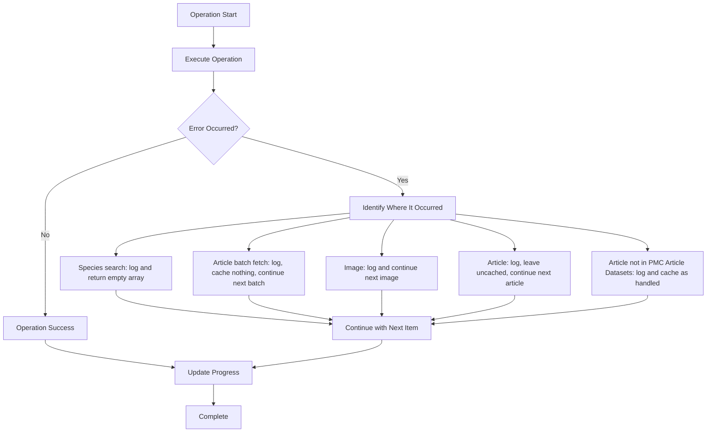
```mermaid
graph TD
    accTitle: Error Recovery Workflow
    accDescr: When an operation runs and an error occurs, the tool identifies where it happened and logs it with console.error or console.log, then continues with the next item. A species search error returns an empty array. A batch fetch error caches nothing from the batch and continues with the next batch. An image that fails to download or verify is logged and the remaining images of the article are still downloaded. An article error is logged and the article is left uncached before the next article, except an article that is not in the PMC Article Datasets, which is logged and cached as handled. The cache directory is created when the cache file is missing, and an article's output directory is created when its first verified image is written. The tool does not back off or retry within a run; uncached articles are retried on the next run.

    A[Operation Start] --> B[Execute Operation]
    B --> C{Error Occurred?}

    C -->|No| D[Operation Success]
    C -->|Yes| E[Identify Where It Occurred]

    E --> F[Species search: log and return empty array]
    E --> G[Article batch fetch: log, cache nothing, continue next batch]
    E --> R[Image: log and continue next image]
    E --> H[Article: log, leave uncached, continue next article]
    E --> S[Article not in PMC Article Datasets: log and cache as handled]

    F --> O[Continue with Next Item]
    G --> O
    R --> O
    H --> O
    S --> O
    D --> P[Update Progress]
    O --> P
    P --> Q[Complete]
```

## Cache Management Pipeline

### Cache Read/Write Workflow

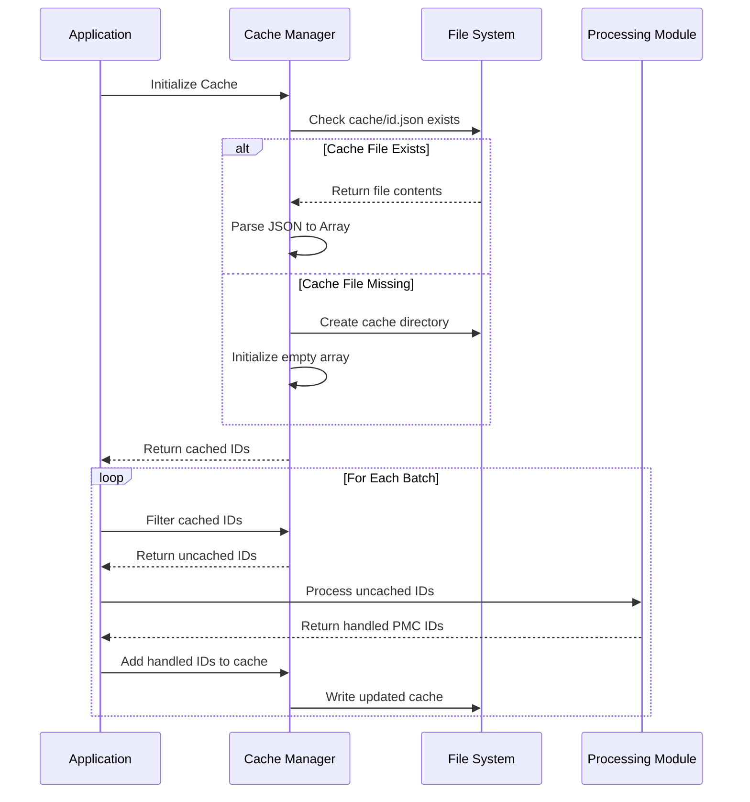
```mermaid
sequenceDiagram
    accTitle: Cache Read and Write Workflow
    accDescr: The application initializes the cache, and the cache manager checks whether cache/id.json exists. If it exists, its contents are read and parsed into an array; if not, the cache directory is created and an empty array is initialized. For each batch the application filters cached IDs and processes the uncached IDs. The processing module returns the PMC IDs of the articles it handled, and the application asks the cache manager to add only the batch IDs that match them, which writes the updated cache to the file system. Failed articles stay uncached and are retried on the next run.

    participant App as Application
    participant CM as Cache Manager
    participant FS as File System
    participant Proc as Processing Module

    App->>CM: Initialize Cache
    CM->>FS: Check cache/id.json exists

    alt Cache File Exists
        FS-->>CM: Return file contents
        CM->>CM: Parse JSON to Array
    else Cache File Missing
        CM->>FS: Create cache directory
        CM->>CM: Initialize empty array
    end

    CM-->>App: Return cached IDs

    loop For Each Batch
        App->>CM: Filter cached IDs
        CM-->>App: Return uncached IDs
        App->>Proc: Process uncached IDs
        Proc-->>App: Return handled PMC IDs
        App->>CM: Add handled IDs to cache
        CM->>FS: Write updated cache
    end
```

### Cache Structure

The cache stores each ID exactly as it was passed to `fetchArticleDetails`, which for the main pipeline is the ESearch `idlist` value. The `PMC`-prefixed form of each ID is used only to match it against the PMC IDs `parseFigures` returns.

```json
["123456", "789012", "345678"]
```

## Performance Optimization Pipeline

### Batch Processing Strategy

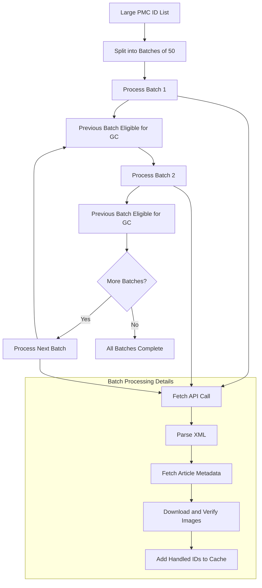
```mermaid
graph TD
    accTitle: Batch Processing Strategy
    accDescr: A large PMC ID list is split into batches of 50. Each batch is processed and the previous batch becomes eligible for garbage collection until no batches remain. Within a batch the tool makes the fetch API call, parses the XML, fetches each article's metadata from the PMC Cloud Service, downloads and verifies the images, and adds the handled articles to the cache.

    A[Large PMC ID List] --> B[Split into Batches of 50]
    B --> C[Process Batch 1]
    C --> D[Previous Batch Eligible for GC]
    D --> E[Process Batch 2]
    E --> F[Previous Batch Eligible for GC]
    F --> G{More Batches?}
    G -->|Yes| H[Process Next Batch]
    G -->|No| I[All Batches Complete]
    H --> D

    subgraph "Batch Processing Details"
        J[Fetch API Call] --> K[Parse XML]
        K --> L[Fetch Article Metadata]
        L --> M[Download and Verify Images]
        M --> N[Add Handled IDs to Cache]
    end

    C --> J
    E --> J
    H --> J
```

## Rate Limiting Pipeline

### Throttling Implementation

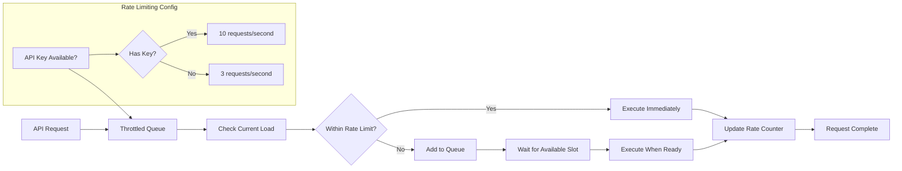
```mermaid
graph LR
    accTitle: Throttling Implementation
    accDescr: An API request enters the throttled queue, which checks the current load against the rate limit. Requests within the limit execute immediately; requests over the limit are queued until a slot is available and then executed. Each request updates the rate counter when complete. The configured rate is 10 requests per second when an API key is present and 3 requests per second otherwise.

    A[API Request] --> B[Throttled Queue]
    B --> C[Check Current Load]
    C --> D{Within Rate Limit?}

    D -->|Yes| E[Execute Immediately]
    D -->|No| F[Add to Queue]

    F --> G[Wait for Available Slot]
    G --> H[Execute When Ready]

    E --> I[Update Rate Counter]
    H --> I
    I --> J[Request Complete]

    subgraph "Rate Limiting Config"
        K[API Key Available?] --> L{Has Key?}
        L -->|Yes| M[10 requests/second]
        L -->|No| N[3 requests/second]
    end

    K --> B
```

The throttled queue covers ESearch and EFetch requests and each article's metadata lookup on the PMC Cloud Service, where the bucket listing and the metadata request run inside one throttled call. Image downloads from the PMC Cloud Service do not go through the queue.

## Monitoring and Logging Pipeline

### Progress Tracking

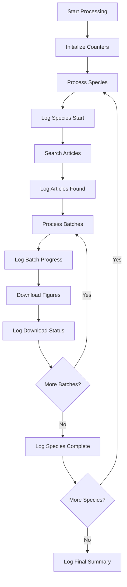
```mermaid
graph TD
    accTitle: Progress Tracking and Logging
    accDescr: Processing starts and counters are initialized. For each species the tool logs the species start, searches articles, logs the articles found, processes batches while logging batch progress, downloads figures while logging download status, and logs species completion. It repeats for each species and logs a final summary when done.

    A[Start Processing] --> B[Initialize Counters]
    B --> C[Process Species]
    C --> D[Log Species Start]
    D --> E[Search Articles]
    E --> F[Log Articles Found]
    F --> G[Process Batches]
    G --> H[Log Batch Progress]
    H --> I[Download Figures]
    I --> J[Log Download Status]
    J --> K{More Batches?}
    K -->|Yes| G
    K -->|No| L[Log Species Complete]
    L --> M{More Species?}
    M -->|Yes| C
    M -->|No| N[Log Final Summary]
```

### Example Log Output Flow

```bash
Searching articles for the species: Arabidopsis_thaliana...
Fetching Arabidopsis thaliana article details for batch 1-50...
Processing article PMC ID: PMC123456
Fetching metadata for PMC123456...
Downloaded image: figure1.jpg
Successfully downloaded 1 images for PMC123456.
Successfully processed article images for PMC123456
Processing article PMC ID: PMC789012
Fetching metadata for PMC789012...
Article PMC789012 is not in the PMC Article Datasets and has no images to download.
All IDs in Arabidopsis thaliana batch 51-100 are already cached.
```

## Resume and Recovery Pipeline

### Interrupted Process Recovery

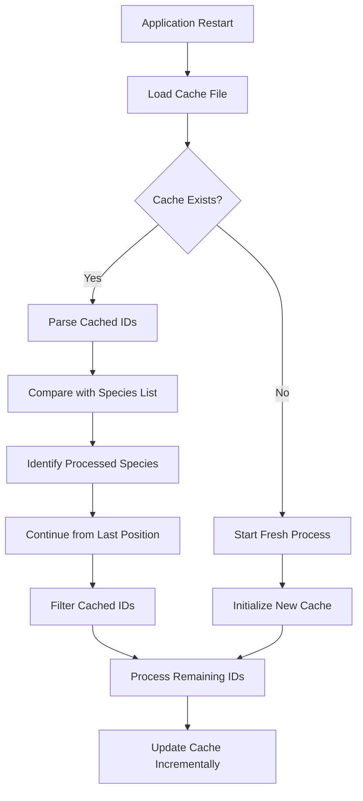
```mermaid
graph TD
    accTitle: Interrupted Process Recovery
    accDescr: After an application restart the tool loads the cache file. If the cache exists, the cached PMC IDs are parsed and compared with the species list to identify processed work and continue from the last position, filtering cached IDs and processing the remaining ones while updating the cache incrementally. If no cache exists, a new cache is initialized and processing starts fresh.

    A[Application Restart] --> B[Load Cache File]
    B --> C{Cache Exists?}

    C -->|Yes| D[Parse Cached IDs]
    C -->|No| E[Start Fresh Process]

    D --> F[Compare with Species List]
    F --> G[Identify Processed Species]
    G --> H[Continue from Last Position]

    H --> I[Filter Cached IDs]
    I --> J[Process Remaining IDs]
    J --> K[Update Cache Incrementally]

    E --> L[Initialize New Cache]
    L --> J
```

This pipeline architecture ensures robust, efficient, and resumable processing of scientific publication figures while respecting external API constraints and providing clear progress tracking throughout the entire workflow.
