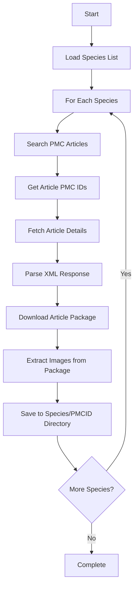
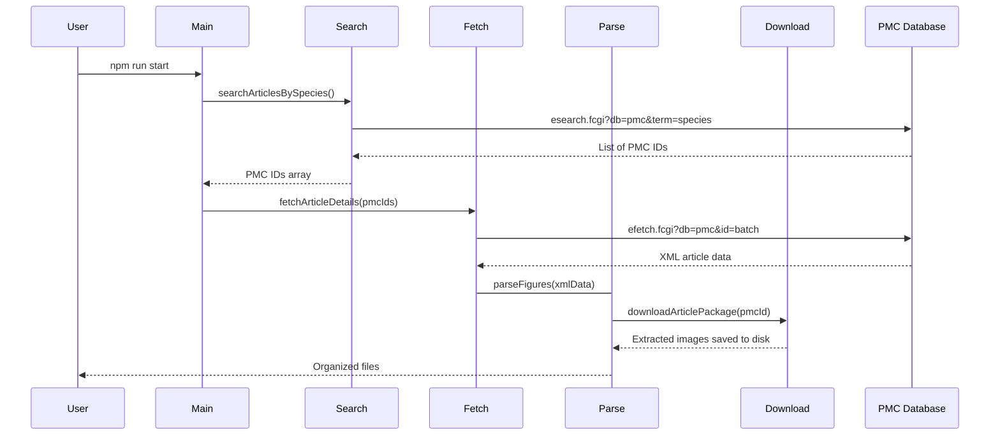

# Publication Figure Retrieval Tool

## Overview

The Publication Figure Retrieval Tool is a specialized utility that automatically downloads scientific figures from publications in NCBI's PubMed Central (PMC) database. It processes a predefined list of species, searches for relevant open-access publications, and downloads all associated figures in an organized directory structure.

This tool is particularly valuable for researchers in bioinformatics, comparative biology, and data mining who need to analyze scientific figures across multiple publications for specific organisms.

## 🚨 Important Disclaimers

- **Educational and Historical Use Only**: This code is maintained primarily for educational and historical reference purposes
- **NCBI Policy Compliance**: Usage must comply with NCBI's policies and rate limits
- **Open Access Only**: The tool only accesses open-access publications from PMC
- **Use at Your Own Risk**: Users are responsible for ensuring their usage complies with applicable policies and terms of service

## Key Features

- **Species-Based Search**: Automatically searches for publications related to specific organisms
- **Bulk Figure Download**: Downloads all figures from matching publications
- **Rate Limiting**: Respects NCBI API rate limits (3 requests/second without API key, 10 with key)
- **Resume Capability**: Can resume interrupted downloads using cached progress
- **Organized Output**: Files are organized by species and publication ID

## System Requirements

- **Node.js**: Version 20 or higher
- **RAM**: Minimum 4GB recommended
- **Internet**: 7+ Mbps download speed recommended
- **Storage**: Varies based on number of figures downloaded

## Workflow Overview



## Example Use Cases

### 1. Figure Dataset Creation

Perfect for creating training datasets for machine learning models that analyze scientific figures:

```bash
# After running the tool, you'll have:
build/output/
├── Homo_sapiens/
│   ├── PMC123456/
│   │   ├── figure1.jpg
│   │   └── figure2.png
│   └── PMC789012/
│       └── figure1.jpg
└── Mus_musculus/
    └── PMC345678/
        ├── figure1.jpg
        ├── figure2.jpg
        └── figure3.png
```

### 2. Research Meta-Analysis

Collecting visual data across multiple publications for systematic reviews or meta-analyses.

## Quick Start

### Installation

```bash
# Clone the repository
git clone https://github.com/AlexJSully/Publication-Figure-Retrieval.git
cd Publication-Figure-Retrieval

# Install dependencies
npm ci
```

### Validate

You can ensure the code is functioning correctly by running the validation script:

```bash
npm run validate
```

### Basic Usage

```bash
# Run the tool
npm run start
```

The tool will:

1. Read species from [`src/data/species.json`](../src/data/species.json)
2. Search PMC for each species (see [`src/processor/searchArticleBySpecies.ts`](../src/processor/searchArticleBySpecies.ts))
3. For each article: fetch article XML, identify the PMC ID, download the article package (.tar.gz) and extract images into `build/output/[species]/[pmcid]/` (see [`src/processor/parseFigures.ts`](../src/processor/parseFigures.ts) and [`src/processor/downloadArticlePackage.ts`](../src/processor/downloadArticlePackage.ts))
4. Cache progress in `build/output/cache/id.json` to enable resume

### With API Key (Recommended)

```bash
# Create .env file
echo "NCBI_API_KEY=your_api_key_here" > .env

# Run with faster rate limits (10 req/sec vs 3 req/sec)
npm run start
```

Get your API key from [NCBI](https://ncbiinsights.ncbi.nlm.nih.gov/2017/11/02/new-api-keys-for-the-e-utilities/).

## Data Flow Architecture



## Output Structure

```text
build/output/
├── cache/
│   └── id.json                    # Cached PMC IDs for resume capability
├── Arabidopsis_thaliana/
│   ├── PMC123456/
│   │   ├── figure1.jpg
│   │   ├── figure2.png
│   │   └── supplementary1.tiff
│   └── PMC789012/
│       └── figure1.jpg
├── Cannabis_sativa/
│   └── PMC345678/
│       ├── figure1.jpg
│       └── figure2.png
└── [other_species]/
    └── [pmcid]/
        └── [figures]
```

## Resume Functionality

If the process is interrupted, simply run `npm run start` again. The tool will:

1. Read cached PMC IDs from `build/output/cache/id.json`
2. Skip already processed publications
3. Continue from where it left off

To start fresh, delete the cache file:

```bash
rm build/output/cache/id.json
```

## Performance Considerations

### Rate Limiting

- **Without API Key**: 3 requests per second
- **With API Key**: 10 requests per second
- Built-in throttling prevents API violations

### Batch Processing

- Article details fetched in batches of 50 PMC IDs
- Efficient for large datasets
- Memory-conscious processing

### Error Handling

- Network errors are logged but don't stop execution
- Invalid URLs are skipped
- Partial downloads can be resumed

## Supported Species

The tool processes 27 plant species defined in [`src/data/species.json`](../src/data/species.json). These include:

- Arabidopsis thaliana (model plant)
- Cannabis sativa (hemp)
- Oryza sativa (rice)
- Triticum aestivum (wheat)
- Zea mays (maize)
- Glycine max (soybean)
- Solanum lycopersicum (tomato)
- And 20 more...

Each species entry includes aliases for better search coverage:

```json
{
	"Arabidopsis_thaliana": {
		"alias": ["Arabidopsis thaliana", "Mouse-ear cress", "Thale cress"]
	}
}
```

## Next Steps

- [Architecture Overview](./architecture/index.md) - Understand the system design
- [Usage Guide](./usage/index.md) - Detailed usage instructions and examples
- [API Documentation](./usage/api/index.md) - Module and function references
- [Contributing](../CONTRIBUTING.md) - How to contribute to the project
- [FAQ](./faq.md) - Common questions and troubleshooting

## Support

For questions, issues, or contributions, please visit the [GitHub repository](https://github.com/AlexJSully/Publication-Figure-Retrieval).
