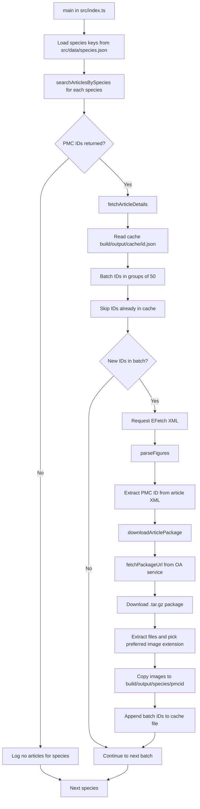

# API Documentation

## Overview

The tool's processing pipeline is composed of five exported functions in the TypeScript source tree:

- [`main`](../../../src/index.ts) in [`src/index.ts`](../../../src/index.ts)
- [`searchArticlesBySpecies`](../../../src/processor/searchArticleBySpecies.ts) in [`src/processor/searchArticleBySpecies.ts`](../../../src/processor/searchArticleBySpecies.ts)
- [`fetchArticleDetails`](../../../src/processor/fetchArticleDetails.ts) in [`src/processor/fetchArticleDetails.ts`](../../../src/processor/fetchArticleDetails.ts)
- [`parseFigures`](../../../src/processor/parseFigures.ts) in [`src/processor/parseFigures.ts`](../../../src/processor/parseFigures.ts)
- [`downloadArticlePackage`](../../../src/processor/downloadArticlePackage.ts) in [`src/processor/downloadArticlePackage.ts`](../../../src/processor/downloadArticlePackage.ts)

The package URL resolver used by the downloader is:

- [`fetchPackageUrl`](../../../src/processor/fetchPackageUrl.ts) in [`src/processor/fetchPackageUrl.ts`](../../../src/processor/fetchPackageUrl.ts)

## Execution Order

1. `main` loads species from [`src/data/species.json`](../../../src/data/species.json)
2. `main` calls `searchArticlesBySpecies` for each species
3. `main` calls `fetchArticleDetails` when PMC IDs are returned
4. `fetchArticleDetails` requests XML batches (50 IDs per batch) from EFetch
5. `fetchArticleDetails` calls `parseFigures` with XML payloads
6. `parseFigures` extracts PMC IDs and calls `downloadArticlePackage`
7. `downloadArticlePackage` fetches the OA package URL, downloads the `.tar.gz`, extracts files, and copies selected image files to `build/output/[species]/[pmcid]/`

## Pipeline Diagram

## Function Reference

### `main(): Promise<void>`

- Location: [`src/index.ts`](../../../src/index.ts)
- Behaviour:
    - Configures API request throughput via `throttled-queue`
    - Iterates all species keys in [`src/data/species.json`](../../../src/data/species.json)
    - Dispatches species-level processing through `searchArticlesBySpecies` and `fetchArticleDetails`

### `searchArticlesBySpecies(throttle, species): Promise<string[]>`

- Location: [`src/processor/searchArticleBySpecies.ts`](../../../src/processor/searchArticleBySpecies.ts)
- Behaviour:
    - Builds an NCBI ESearch query with `term=<species>[organism]`
    - Calls `esearch.fcgi` with `db=pmc`, `retmode=json`, and `retmax=1000000`
    - Adds `api_key` when `NCBI_API_KEY` is present
    - Returns `response.data.esearchresult.idlist`
    - Returns `[]` on request errors

### `fetchArticleDetails(throttle, pmids, species): Promise<void>`

- Location: [`src/processor/fetchArticleDetails.ts`](../../../src/processor/fetchArticleDetails.ts)
- Behaviour:
    - Reads/writes cached IDs in `build/output/cache/id.json`
    - Splits IDs into 50-item batches
    - Skips IDs already present in cache
    - Fetches article XML through `efetch.fcgi`
    - Calls `parseFigures` for each fetched batch
    - Appends processed IDs to cache

### `parseFigures(throttle, xmlData, species): Promise<void>`

- Location: [`src/processor/parseFigures.ts`](../../../src/processor/parseFigures.ts)
- Behaviour:
    - Parses XML with `xml2js`
    - Extracts each article's PMC ID from `article.front[0]["article-meta"][0]["article-id"]`
    - Creates per-article output directories under `build/output`
    - Calls `downloadArticlePackage` for each parsed PMC ID
    - Continues processing when an individual article package fails

### `downloadArticlePackage(throttle, pmcId, outputDir): Promise<string[]>`

- Location: [`src/processor/downloadArticlePackage.ts`](../../../src/processor/downloadArticlePackage.ts)
- Behaviour:
    - Resolves OA package links via `fetchPackageUrl`
    - Downloads a `.tar.gz` package stream
    - Extracts package contents with `tar`
    - Selects one image per basename using extension priority from [`src/constants.ts`](../../../src/constants.ts)
    - Copies selected files into `outputDir`
    - Removes temporary extraction files
    - Returns extracted filenames

### `fetchPackageUrl(pmcId): Promise<PackageInfo>`

- Location: [`src/processor/fetchPackageUrl.ts`](../../../src/processor/fetchPackageUrl.ts)
- Behaviour:
    - Calls PMC OA service endpoint `https://www.ncbi.nlm.nih.gov/pmc/utils/oa/oa.fcgi`
    - Normalizes IDs to `PMC...`
    - Parses XML response and extracts package links
    - Converts `ftp://` link prefixes to `https://`
    - Throws when article/package data is unavailable

## Notes

- `extractFigureUrls` in [`src/processor/extractFigureUrls.ts`](../../../src/processor/extractFigureUrls.ts) is currently a standalone utility and is not invoked by the active main pipeline.
- `fetchPackageUrlsBatch` in [`src/processor/fetchPackageUrl.ts`](../../../src/processor/fetchPackageUrl.ts) is also exported but not invoked by the active main pipeline; the pipeline uses `fetchPackageUrl` for one article at a time.
- Cache file format is a JSON array of PMC ID strings, not an object.
