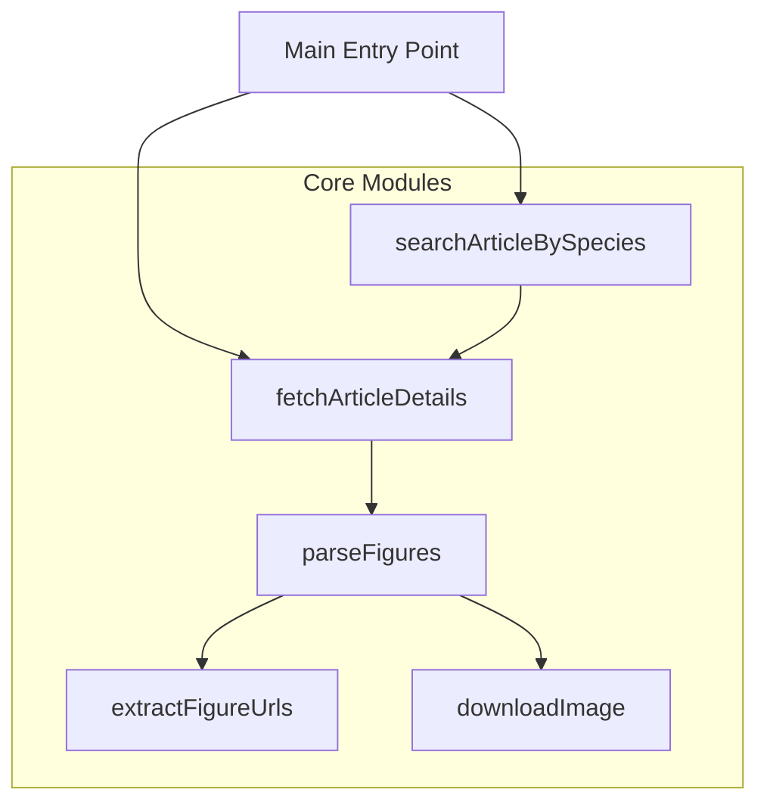
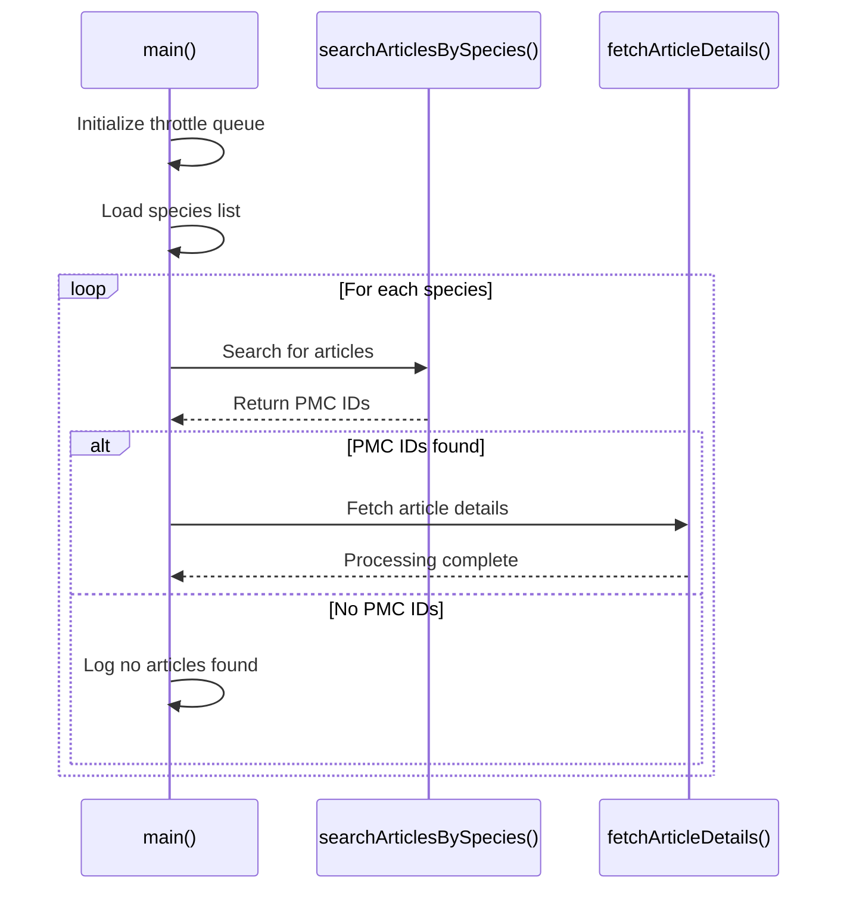
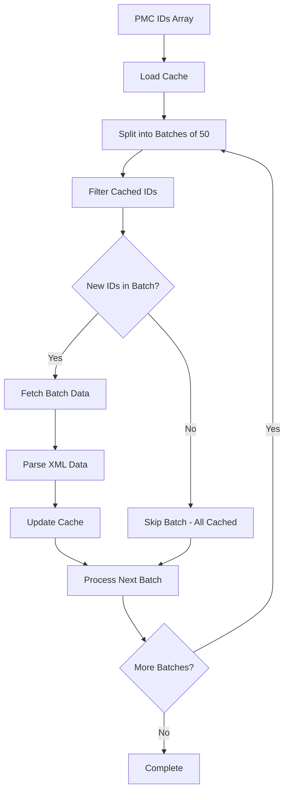
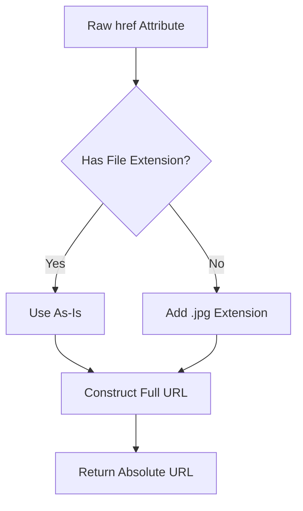
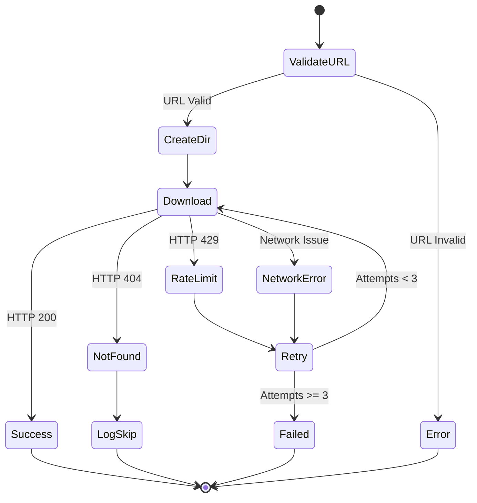

# API Documentation

## Module Overview

The Publication Figure Retrieval Tool consists of several specialized modules, each handling a specific aspect of the figure retrieval pipeline. This documentation provides comprehensive coverage of all public functions, their parameters, return values, and usage examples.

## Module Architecture



## Core Functions

### Main Entry Point

#### `main()`

**Location**: `src/index.ts`

**Description**: The primary orchestrator function that coordinates the entire figure retrieval workflow.

**Signature**:

```typescript
async function main(): Promise<void>;
```

**Workflow**:



**Example Usage**:

```typescript
// Called automatically when running npm start
import { main } from "./index";

await main();
```

**Error Handling**:

- Gracefully handles network failures
- Continues processing other species if one fails
- Logs errors without stopping execution

---

## Search Module

### `searchArticlesBySpecies()`

**Location**: `src/processor/searchArticleBySpecies.ts`

**Description**: Searches NCBI PMC database for articles related to a specific species using the E-search API.

**Signature**:

```typescript
export async function searchArticlesBySpecies(throttle: any, species: string): Promise<string[]>;
```

**Parameters**:

| Parameter  | Type     | Description                                     |
| ---------- | -------- | ----------------------------------------------- |
| `throttle` | `any`    | Throttling function to control API request rate |
| `species`  | `string` | Species name (e.g., "Arabidopsis_thaliana")     |

**Returns**: `Promise<string[]>` - Array of PMC IDs

**Example Usage**:

```typescript
import { throttledQueue } from "throttled-queue";
import { searchArticlesBySpecies } from "./processor/searchArticleBySpecies";

const throttle = throttledQueue({ maxPerInterval: 3, interval: 1000 });
const species = "Homo_sapiens";

const pmcIds = await searchArticlesBySpecies(throttle, species);
console.log(`Found ${pmcIds.length} articles for ${species}`);
// Output: Found 1247 articles for Homo_sapiens
```

**API Call Details**:

```typescript
// Constructs URL like:
// https://eutils.ncbi.nlm.nih.gov/entrez/eutils/esearch.fcgi?db=pmc&term=Homo_sapiens[organism]&retmode=json&retmax=1000000
```

**Error Handling**:

- Returns empty array on network errors
- Logs errors to console
- Does not throw exceptions

**Response Format**:

```json
{
	"esearchresult": {
		"idlist": ["PMC123456", "PMC789012", "PMC345678"]
	}
}
```

---

## Fetch Module

### `fetchArticleDetails()`

**Location**: `src/processor/fetchArticleDetails.ts`

**Description**: Fetches detailed XML article data from NCBI PMC in batches, with caching support for resume functionality.

**Signature**:

```typescript
export async function fetchArticleDetails(throttle: any, pmids: string[], species: string): Promise<void>;
```

**Parameters**:

| Parameter  | Type       | Description                               |
| ---------- | ---------- | ----------------------------------------- |
| `throttle` | `any`      | Throttling function for API rate limiting |
| `pmids`    | `string[]` | Array of PMC IDs to fetch                 |
| `species`  | `string`   | Species name for organization and logging |

**Returns**: `Promise<void>` - No return value (processes articles directly)

**Batch Processing Flow**:



**Example Usage**:

```typescript
import { fetchArticleDetails } from "./processor/fetchArticleDetails";

const pmids = ["PMC123456", "PMC789012", "PMC345678"];
const species = "Arabidopsis_thaliana";

await fetchArticleDetails(throttle, pmids, species);
// Processes all PMC IDs, downloads figures, updates cache
```

**Cache Management**:

```typescript
// Cache file location: build/output/cache/id.json
// Cache structure:
["PMC123456", "PMC789012", "PMC345678"];
```

**API URL Structure**:

```typescript
// E-fetch URL example:
// https://eutils.ncbi.nlm.nih.gov/entrez/eutils/efetch.fcgi?db=pmc&id=PMC123456,PMC789012&retmode=xml&api_key=optional
```

---

## Parse Module

### `parseFigures()`

**Location**: `src/processor/parseFigures.ts`

**Description**: Parses XML article data to extract figure information and coordinates the download process.

**Signature**:

```typescript
export async function parseFigures(throttle: any, xmlData: string, species: string): Promise<void>;
```

**Parameters**:

| Parameter  | Type     | Description                                    |
| ---------- | -------- | ---------------------------------------------- |
| `throttle` | `any`    | Throttling function for download rate limiting |
| `xmlData`  | `string` | Raw XML data from PMC E-fetch API              |
| `species`  | `string` | Species name for file organization             |

**XML Processing Flow**:


**Example Usage**:

```typescript
import { parseFigures } from "./processor/parseFigures";

const xmlData = `<pmc-articleset>
  <article>
    <front>
      <article-meta>
        <article-id pub-id-type="pmc">PMC123456</article-id>
      </article-meta>
    </front>
    <body>
      <fig>
        <graphic xlink:href="figure1.jpg"/>
      </fig>
    </body>
  </article>
</pmc-articleset>`;

await parseFigures(throttle, xmlData, "Homo_sapiens");
// Downloads figures to build/output/Homo_sapiens/PMC123456/
```

**XML Structure Expected**:

```xml
<pmc-articleset>
  <article>
    <front>
      <article-meta>
        <article-id pub-id-type="pmc">PMC123456</article-id>
      </article-meta>
    </front>
    <body>
      <fig id="fig1">
        <graphic xlink:href="figure1.jpg"/>
        <graphic xlink:href="supplementary1.tiff"/>
      </fig>
    </body>
  </article>
</pmc-articleset>
```

---

## Extract Module

### `extractFigureUrls()`

**Location**: `src/processor/extractFigureUrls.ts`

**Description**: Extracts figure URLs from parsed article XML structure and constructs absolute PMC URLs.

**Signature**:

```typescript
export function extractFigureUrls(article: any, pmcId: string): string[];
```

**Parameters**:

| Parameter | Type     | Description                       |
| --------- | -------- | --------------------------------- |
| `article` | `any`    | Parsed article object from xml2js |
| `pmcId`   | `string` | PMC ID for URL construction       |

**Returns**: `string[]` - Array of absolute figure URLs

**URL Construction Logic**:



**Example Usage**:

```typescript
import { extractFigureUrls } from "./processor/extractFigureUrls";

const article = {
	body: [
		{
			fig: [
				{
					graphic: [
						{ $: { "xlink:href": "figure1.jpg" } },
						{ $: { "xlink:href": "supplementary1" } }, // No extension
					],
				},
			],
		},
	],
};

const pmcId = "PMC123456";
const urls = extractFigureUrls(article, pmcId);

console.log(urls);
// Output:
// [
//   "https://www.ncbi.nlm.nih.gov/pmc/articles/PMC123456/bin/figure1.jpg",
//   "https://www.ncbi.nlm.nih.gov/pmc/articles/PMC123456/bin/supplementary1.jpg"
// ]
```

**Supported File Formats**:

- `.jpg` / `.jpeg`
- `.png`
- `.gif`
- `.tiff`
- `.svg`

**Edge Cases Handled**:

- Missing file extensions (adds `.jpg`)
- Empty figure arrays
- Missing body sections
- Malformed XML structures

---

## Download Module

### `downloadImage()`

**Location**: `src/processor/downloadImage.ts`

**Description**: Downloads individual figure files from PMC URLs with error handling and retry logic.

**Signature**:

```typescript
export async function downloadImage(throttle: any, imageUrl: string, filePath: string): Promise<void>;
```

**Parameters**:

| Parameter  | Type     | Description                                    |
| ---------- | -------- | ---------------------------------------------- |
| `throttle` | `any`    | Throttling function for download rate limiting |
| `imageUrl` | `string` | Absolute URL of the figure to download         |
| `filePath` | `string` | Local file system path for saving              |

**Download State Machine**:



**Example Usage**:

```typescript
import { downloadImage } from "./processor/downloadImage";

const imageUrl = "https://www.ncbi.nlm.nih.gov/pmc/articles/PMC123456/bin/figure1.jpg";
const filePath = "/path/to/output/Homo_sapiens/PMC123456/figure1.jpg";

try {
	await downloadImage(throttle, imageUrl, filePath);
	console.log("Download successful");
} catch (error) {
	console.error("Download failed:", error);
}
```

**Directory Creation**:

```typescript
// Automatically creates directory structure:
// build/output/[species]/[pmcId]/
// Example: build/output/Homo_sapiens/PMC123456/figure1.jpg
```

**Error Handling Examples**:

```typescript
// Network timeout
try {
	await downloadImage(throttle, url, path);
} catch (error) {
	// Logs: "Failed to download figure1.jpg: Network timeout"
	// Continues with next figure
}

// File not found (404)
// Logs: "Figure not found: figure1.jpg (HTTP 404)"
// Skips without error

// Rate limit exceeded (429)
// Automatically retries after delay
```

## Utility Functions

### Rate Limiting Configuration

```typescript
// From src/index.ts
const ncbiApiKey = process?.env?.NCBI_API_KEY;
const callsPerSecond = ncbiApiKey ? 10 : 3;

const throttle = throttledQueue({
	maxPerInterval: callsPerSecond,
	interval: 1000,
});
```

### Species Data Loading

```typescript
// From src/index.ts
import speciesData from "./data/species.json";
const speciesList = Object.keys(speciesData);

// Example species.json structure:
{
  "Arabidopsis_thaliana": {
    "alias": ["Arabidopsis thaliana", "Mouse-ear cress"]
  }
}
```

## Integration Examples

### Custom Processing Pipeline

```typescript
import { throttledQueue } from "throttled-queue";
import { fetchArticleDetails } from "./processor/fetchArticleDetails";
import { searchArticlesBySpecies } from "./processor/searchArticleBySpecies";

async function customPipeline(targetSpecies: string[]) {
	const throttle = throttledQueue({ maxPerInterval: 3, interval: 1000 });

	for (const species of targetSpecies) {
		console.log(`Processing ${species}...`);

		// Search for articles
		const pmids = await searchArticlesBySpecies(throttle, species);

		if (pmids.length > 0) {
			// Fetch and process articles
			await fetchArticleDetails(throttle, pmids, species);
			console.log(`Completed ${species}: ${pmids.length} articles`);
		} else {
			console.log(`No articles found for ${species}`);
		}
	}
}

// Usage
await customPipeline(["Homo_sapiens", "Mus_musculus"]);
```

### Figure Analysis Integration

```typescript
import { extractFigureUrls } from "./processor/extractFigureUrls";

async function analyzeFigureMetadata(article: any, pmcId: string) {
	const figureUrls = extractFigureUrls(article, pmcId);

	const metadata = {
		pmcId,
		figureCount: figureUrls.length,
		figureTypes: figureUrls.map((url) => {
			const extension = url.split(".").pop();
			return extension;
		}),
		totalSize: 0, // Would be calculated after download
	};

	return metadata;
}
```

This API documentation provides complete coverage of all public functions in the Publication Figure Retrieval Tool, enabling developers to understand, extend, and integrate the tool into their own research workflows.
