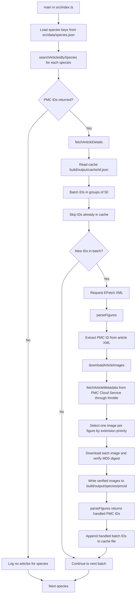

# API Documentation

## Overview

The tool's processing pipeline is composed of five exported functions in the TypeScript source tree:

- [`main`](../../../src/index.ts) in [`src/index.ts`](../../../src/index.ts)
- [`searchArticlesBySpecies`](../../../src/processor/searchArticleBySpecies.ts) in [`src/processor/searchArticleBySpecies.ts`](../../../src/processor/searchArticleBySpecies.ts)
- [`fetchArticleDetails`](../../../src/processor/fetchArticleDetails.ts) in [`src/processor/fetchArticleDetails.ts`](../../../src/processor/fetchArticleDetails.ts)
- [`parseFigures`](../../../src/processor/parseFigures.ts) in [`src/processor/parseFigures.ts`](../../../src/processor/parseFigures.ts)
- [`downloadArticleImages`](../../../src/processor/downloadArticleImages.ts) in [`src/processor/downloadArticleImages.ts`](../../../src/processor/downloadArticleImages.ts)

The PMC Cloud Service metadata helpers used by the downloader and the cache are exported from [`src/processor/fetchArticleMetadata.ts`](../../../src/processor/fetchArticleMetadata.ts):

- [`fetchArticleMetadata`](../../../src/processor/fetchArticleMetadata.ts)
- [`withPmcPrefix`](../../../src/processor/fetchArticleMetadata.ts)
- [`assertValidPmcId`](../../../src/processor/fetchArticleMetadata.ts)
- [`ArticleNotInDatasetError`](../../../src/processor/fetchArticleMetadata.ts)

## Execution Order

1. `main` loads species from [`src/data/species.json`](../../../src/data/species.json)
2. `main` calls `searchArticlesBySpecies` for each species
3. `main` calls `fetchArticleDetails` when PMC IDs are returned
4. `fetchArticleDetails` requests XML batches (50 IDs per batch) from EFetch
5. `fetchArticleDetails` calls `parseFigures` with XML payloads
6. `parseFigures` extracts PMC IDs and calls `downloadArticleImages` for one article at a time
7. `downloadArticleImages` fetches the article's metadata from the PMC Cloud Service with `fetchArticleMetadata`, downloads each selected image, verifies its MD5 digest, and writes verified images to `build/output/[species]/[pmcid]/`
8. `parseFigures` returns the PMC IDs it handled, and `fetchArticleDetails` adds the matching batch IDs to `build/output/cache/id.json`

## Pipeline Diagram

```mermaid
flowchart TD
    accTitle: API Processing Pipeline
    accDescr: main loads species keys and calls searchArticlesBySpecies for each species. If no PMC IDs are returned it logs that and moves to the next species. Otherwise fetchArticleDetails reads the cache file, splits the IDs into batches of 50 and skips IDs already cached; a batch with no new IDs is skipped. For a batch with new IDs it requests EFetch XML and calls parseFigures, which awaits XML parsing and handles one article at a time. For each article it extracts the PMC ID and calls downloadArticleImages, which fetches the article metadata through the throttle by listing the PMC Cloud Service bucket for the highest article version and reading its metadata JSON. It selects one image per figure by extension priority, downloads each image, verifies its MD5 digest and writes verified images to build/output/species/pmcid. Articles whose images were all retrieved, and articles not in the PMC Article Datasets, are reported as handled; other failures are logged and left out. fetchArticleDetails then appends only the handled batch IDs to the cache file and continues with the next batch.

    A[main in src/index.ts] --> B[Load species keys from src/data/species.json]
    B --> C[searchArticlesBySpecies for each species]
    C --> D{PMC IDs returned?}
    D -->|No| E[Log no articles for species]
    D -->|Yes| F[fetchArticleDetails]
    F --> G[Read cache build/output/cache/id.json]
    G --> H[Batch IDs in groups of 50]
    H --> I[Skip IDs already in cache]
    I --> J{New IDs in batch?}
    J -->|No| K[Continue to next batch]
    J -->|Yes| L[Request EFetch XML]
    L --> M[parseFigures]
    M --> N[Extract PMC ID from article XML]
    N --> O[downloadArticleImages]
    O --> P[fetchArticleMetadata from PMC Cloud Service through throttle]
    P --> Q[Select one image per figure by extension priority]
    Q --> R[Download each image and verify MD5 digest]
    R --> S[Write verified images to build/output/species/pmcid]
    S --> T[parseFigures returns handled PMC IDs]
    T --> U[Append handled batch IDs to cache file]
    U --> K
    E --> V[Next species]
    K --> V
```

## Function Reference

### `main(): Promise<void>`

- Location: [`src/index.ts`](../../../src/index.ts)
- Behaviour:
    - Configures API request throughput via `throttled-queue`
    - Iterates all species keys in [`src/data/species.json`](../../../src/data/species.json)
    - Dispatches species-level processing through `searchArticlesBySpecies` and `fetchArticleDetails`

### `searchArticlesBySpecies(throttle, species): Promise<string[]>`

- Location: [`src/processor/searchArticleBySpecies.ts`](../../../src/processor/searchArticleBySpecies.ts)
- Behaviour:
    - Builds an NCBI ESearch query with `term=<species>[organism] AND (open_access[Filter] OR author_manuscript[Filter])`, which limits results to articles available in the PMC Article Datasets on the PMC Cloud Service
    - Calls `esearch.fcgi` with `db=pmc`, `retmode=json`, and `retmax=1000000`
    - Adds `api_key` when `NCBI_API_KEY` is present
    - Returns `response.data.esearchresult.idlist`
    - Returns `[]` on request errors

### `fetchArticleDetails(throttle, pmids, species): Promise<void>`

- Location: [`src/processor/fetchArticleDetails.ts`](../../../src/processor/fetchArticleDetails.ts)
- Behaviour:
    - Reads/writes cached IDs in `build/output/cache/id.json`
    - Splits IDs into 50-item batches
    - Skips IDs already present in cache
    - Fetches article XML through `efetch.fcgi`
    - Calls `parseFigures` for each fetched batch and waits for it to finish
    - Appends to the cache only the batch IDs whose `PMC`-prefixed form (from `withPmcPrefix`) is in the list `parseFigures` returns, so failed articles are retried on the next run
    - Caches nothing for a batch whose EFetch request fails

### `parseFigures(throttle, xmlData, species): Promise<string[]>`

- Location: [`src/processor/parseFigures.ts`](../../../src/processor/parseFigures.ts)
- Behaviour:
    - Parses XML with `xml2js` and awaits the result
    - Returns `[]` when the XML cannot be parsed or contains no articles
    - Extracts each article's PMC ID from `article.front[0]["article-meta"][0]["article-id"]`
    - Calls `downloadArticleImages` for each parsed PMC ID, one article at a time, with the output directory `build/output/<species>/<pmcid>`
    - Returns the PMC IDs of articles whose images were retrieved and of articles that throw `ArticleNotInDatasetError`
    - Logs any other failure and leaves that article out of the returned list, then continues with the next article

### `downloadArticleImages(throttle, pmcId, outputDir): Promise<string[]>`

- Location: [`src/processor/downloadArticleImages.ts`](../../../src/processor/downloadArticleImages.ts)
- Behaviour:
    - Throws `Invalid PMC ID` through `assertValidPmcId` unless the ID is `PMC` followed by digits, or digits alone
    - Fetches the article metadata with `fetchArticleMetadata` inside the throttle
    - Selects image media URLs in the `pmc-oa-opendata` bucket under the article version's own `<pmcid>.<version>/` prefix, keeping one file per figure basename by the extension priority in [`src/constants.ts`](../../../src/constants.ts)
    - Skips any media file name containing a `/` or `\` separator or a drive prefix such as `C:`
    - Logs `No images found for <id>.` and returns `[]` when no image is selected
    - Downloads each selected image one at a time from `https://pmc-oa-opendata.s3.amazonaws.com`, outside the throttle
    - Verifies each image against the MD5 digest in the media URL's `md5` query parameter and writes only verified images
    - Creates `outputDir` only when the first verified image is written
    - Throws `<n> of <m> images failed for <id>` if any image fails to download or verify; images already verified stay on disk
    - Returns the file names of the images written

### `fetchArticleMetadata(pmcId): Promise<ArticleMetadata>`

- Location: [`src/processor/fetchArticleMetadata.ts`](../../../src/processor/fetchArticleMetadata.ts)
- Behaviour:
    - Throws `Invalid PMC ID` through `assertValidPmcId` before any request
    - Normalizes the ID to `PMC...` with `withPmcPrefix`
    - Lists the PMC Cloud Service bucket under the `<pmcid>.` prefix with an S3 `ListObjectsV2` request
    - Picks the highest-numbered article version from the `<pmcid>.<version>/` prefixes
    - Fetches `metadata/<pmcid>.<version>.json` from the bucket
    - Throws `ArticleNotInDatasetError` when the article has no version in the PMC Article Datasets
    - Throws `Failed to fetch metadata for <pmcid>: <message>` when a request to the bucket fails, or when the metadata's `pmcid` and `version` are not the ones requested
    - Uses a 30 second request timeout (`PMC_CLOUD_REQUEST_TIMEOUT_MS`)

### `withPmcPrefix(pmcId): string`

- Location: [`src/processor/fetchArticleMetadata.ts`](../../../src/processor/fetchArticleMetadata.ts)
- Behaviour:
    - Returns the ID unchanged when it starts with `PMC`, otherwise prefixes it with `PMC`

### `assertValidPmcId(pmcId): asserts pmcId is string`

- Location: [`src/processor/fetchArticleMetadata.ts`](../../../src/processor/fetchArticleMetadata.ts)
- Behaviour:
    - Throws `Invalid PMC ID: <id>` unless the ID is a string of `PMC` followed by digits, or digits alone (`PMC_ID_PATTERN` in [`src/constants.ts`](../../../src/constants.ts))

### `ArticleNotInDatasetError`

- Location: [`src/processor/fetchArticleMetadata.ts`](../../../src/processor/fetchArticleMetadata.ts)
- Behaviour:
    - Error class thrown when an article has no version in the PMC Article Datasets, with the message `Article <pmcid> is not in the PMC Article Datasets`

## Notes

- `extractFigureUrls` in [`src/processor/extractFigureUrls.ts`](../../../src/processor/extractFigureUrls.ts) is currently a standalone utility and is not invoked by the active main pipeline.
- Cache file format is a JSON array of ID strings, stored exactly as they were passed to `fetchArticleDetails` (the ESearch `idlist` values), not an object.
