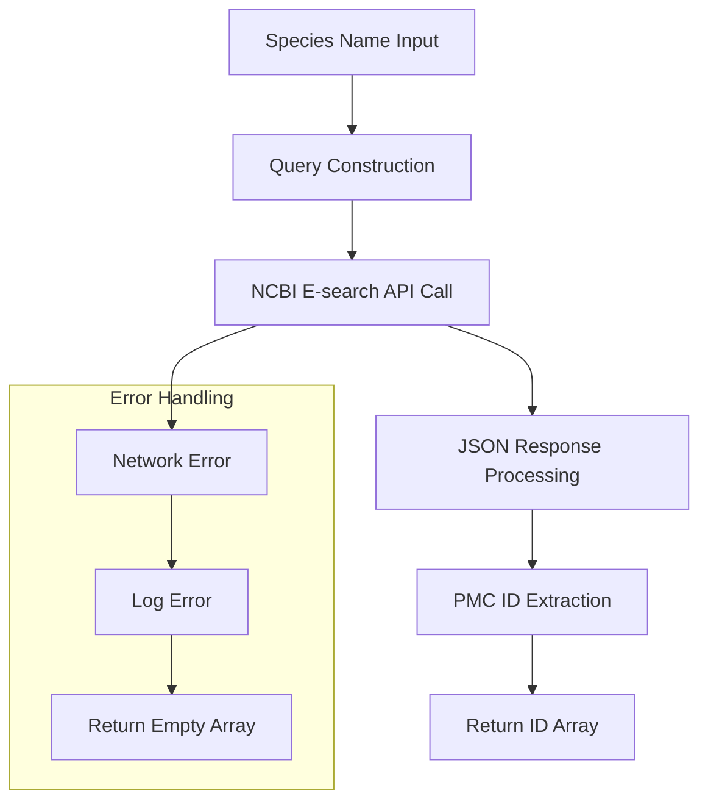
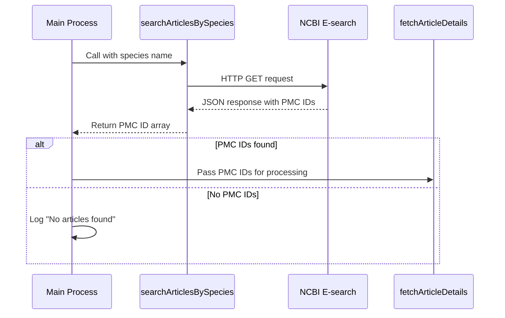

# searchArticleBySpecies Module

## Overview

The `searchArticleBySpecies` module handles the discovery of scientific publications in NCBI's PubMed Central database based on organism/species queries. It serves as the entry point for the figure retrieval pipeline.

## Module Architecture



## Function: `searchArticlesBySpecies`

### Signature

```typescript
export async function searchArticlesBySpecies(throttle: ThrottleFunction, species: string): Promise<string[]>;
```

### Parameters

| Parameter  | Type               | Required | Description                                                      |
| ---------- | ------------------ | -------- | ---------------------------------------------------------------- |
| `throttle` | `ThrottleFunction` | Yes      | Throttling function from `throttled-queue` for API rate limiting |
| `species`  | `string`           | Yes      | Species name in underscore format (e.g., "Homo_sapiens")         |

### Return Value

- **Type**: `Promise<string[]>`
- **Description**: The function returns the ID list provided by the NCBI response at `response.data.esearchresult.idlist`. The implementation returns the value directly from the API response (see [`src/processor/searchArticleBySpecies.ts`](../../../src/processor/searchArticleBySpecies.ts)).
- **Example**: `["PMC123456", "PMC789012"]` (exact contents depend on the API response)

### API Integration

#### NCBI E-search Endpoint

```typescript
// Base URL construction
const query = `${species}[organism]`;
const baseUrl = "https://eutils.ncbi.nlm.nih.gov/entrez/eutils/esearch.fcgi";
const params = {
	db: "pmc", // PubMed Central database
	term: encodeURIComponent(query),
	retmode: "json", // JSON response format
	retmax: "1000000", // Maximum results (high limit)
};
```

#### Query Examples

```typescript
// Human articles
const humanQuery = "Homo_sapiens[organism]";
// URL: ...esearch.fcgi?db=pmc&term=Homo_sapiens%5Borganism%5D&retmode=json&retmax=1000000

// Plant model organism
const plantQuery = "Arabidopsis_thaliana[organism]";
// URL: ...esearch.fcgi?db=pmc&term=Arabidopsis_thaliana%5Borganism%5D&retmode=json&retmax=1000000
```

### Usage Examples

#### Basic Usage

```typescript
import { throttledQueue } from "throttled-queue";
import { searchArticlesBySpecies } from "./searchArticleBySpecies";

// Configure rate limiting
const throttle = throttledQueue({
	maxPerInterval: 3, // 3 requests per second (no API key)
	interval: 1000,
});

// Search for human articles
const humanPmcIds = await searchArticlesBySpecies(throttle, "Homo_sapiens");
console.log(`Found ${humanPmcIds.length} human articles`);
// Output: Found 15724 human articles
```

#### Multiple Species Processing

```typescript
const speciesList = ["Homo_sapiens", "Mus_musculus", "Arabidopsis_thaliana", "Caenorhabditis_elegans"];

const results = new Map<string, string[]>();

for (const species of speciesList) {
	console.log(`Searching for ${species}...`);
	const pmcIds = await searchArticlesBySpecies(throttle, species);
	results.set(species, pmcIds);

	console.log(`${species}: ${pmcIds.length} articles found`);
}

// Example output:
// Searching for Homo_sapiens...
// Homo_sapiens: 15724 articles found
// Searching for Mus_musculus...
// Mus_musculus: 12453 articles found
```

#### With API Key (Faster Rate Limiting)

```typescript
// Configure for API key usage (10 req/sec vs 3 req/sec)
const throttleWithKey = throttledQueue({
	maxPerInterval: 10,
	interval: 1000,
});

// Set environment variable
process.env.NCBI_API_KEY = "your_api_key_here";

const pmcIds = await searchArticlesBySpecies(throttleWithKey, "Cannabis_sativa");
```

### Response Processing

#### NCBI JSON Response Structure

```json
{
	"header": {
		"type": "esearch",
		"version": "0.3"
	},
	"esearchresult": {
		"count": "1247",
		"retmax": "1000000",
		"retstart": "0",
		"idlist": ["123456", "789012", "345678"],
		"translationset": [],
		"translationstack": [],
		"querytranslation": "Homo sapiens[Organism]"
	}
}
```

#### Processing Logic

```typescript
// From the actual implementation
try {
	const response = await throttle(async () => await axios.get(url));
	return response.data.esearchresult.idlist; // Returns array of PMC IDs
} catch (error) {
	console.error("Error fetching articles:", error);
	return []; // Returns empty array on error
}
```

### Error Handling

#### Network Errors

```typescript
// Example: Network timeout
try {
	const pmcIds = await searchArticlesBySpecies(throttle, "Homo_sapiens");
} catch (error) {
	// Function handles errors internally, returns empty array
	console.log(pmcIds); // []
}
```

#### API Errors

```typescript
// Example: Rate limit exceeded (HTTP 429)
// The throttle function prevents this, but if it occurs:
// - Error is logged to console
// - Empty array is returned
// - Processing continues with next species
```

#### Invalid Species Names

```typescript
// Non-existent species
const pmcIds = await searchArticlesBySpecies(throttle, "Nonexistent_species");
console.log(pmcIds); // [] (empty array, not an error)
```

### Integration Patterns

#### Pipeline Integration



#### Custom Filtering

```typescript
async function searchWithFilters(species: string, minYear: number) {
	const allPmcIds = await searchArticlesBySpecies(throttle, species);

	// Note: Advanced filtering would require additional API calls
	// This is a conceptual example
	console.log(`Found ${allPmcIds.length} articles for ${species}`);

	return allPmcIds;
}
```

### Performance Considerations

#### Rate Limiting

```typescript
// Without API key: 3 requests/second maximum
const throttleNoKey = throttledQueue({ maxPerInterval: 3, interval: 1000 });

// With API key: 10 requests/second maximum
const throttleWithKey = throttledQueue({ maxPerInterval: 10, interval: 1000 });

// Processing time estimate for 10 species:
// Without key: ~3.3 seconds minimum
// With key: ~1 second minimum
```

#### Large Result Sets

```typescript
// NCBI returns up to 1,000,000 results by default
// For very large species (like Homo sapiens), this captures most articles
// Typical ranges:
// - Model organisms: 1,000-50,000 articles
// - Major species: 10,000-100,000+ articles
// - Rare species: 10-1,000 articles
```

### Testing Examples

#### Unit Test Structure

```typescript
import axios from "axios";
import { searchArticlesBySpecies } from "./searchArticleBySpecies";

jest.mock("axios");

describe("searchArticlesBySpecies", () => {
	const throttle = jest.fn((fn) => fn());

	it("should return PMC IDs for valid species", async () => {
		const mockResponse = {
			data: {
				esearchresult: {
					idlist: ["123456", "789012"],
				},
			},
		};

		(axios.get as jest.Mock).mockResolvedValue(mockResponse);

		const result = await searchArticlesBySpecies(throttle, "Homo_sapiens");

		expect(result).toEqual(["123456", "789012"]);
		expect(axios.get).toHaveBeenCalledWith(expect.stringContaining("Homo_sapiens%5Borganism%5D"));
	});
});
```

### Troubleshooting

#### Common Issues

1. **Empty Results for Valid Species**

    ```typescript
    // Check species name format - use underscores, not spaces
    ❌ "Homo sapiens"
    ✅ "Homo_sapiens"
    ```

2. **Rate Limiting Errors**

    ```typescript
    // Ensure throttle function is properly configured
    const throttle = throttledQueue({ maxPerInterval: 3, interval: 1000 });
    ```

3. **Network Connectivity**

    ```typescript
    // Test basic connectivity to NCBI
    try {
    	const response = await axios.get("https://eutils.ncbi.nlm.nih.gov/");
    	console.log("NCBI accessible");
    } catch (error) {
    	console.error("NCBI not accessible:", error);
    }
    ```

This module forms the foundation of the figure retrieval pipeline by providing the initial discovery mechanism for relevant scientific publications.
