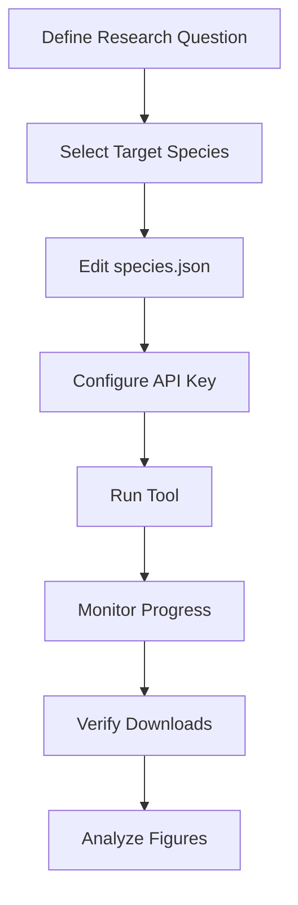
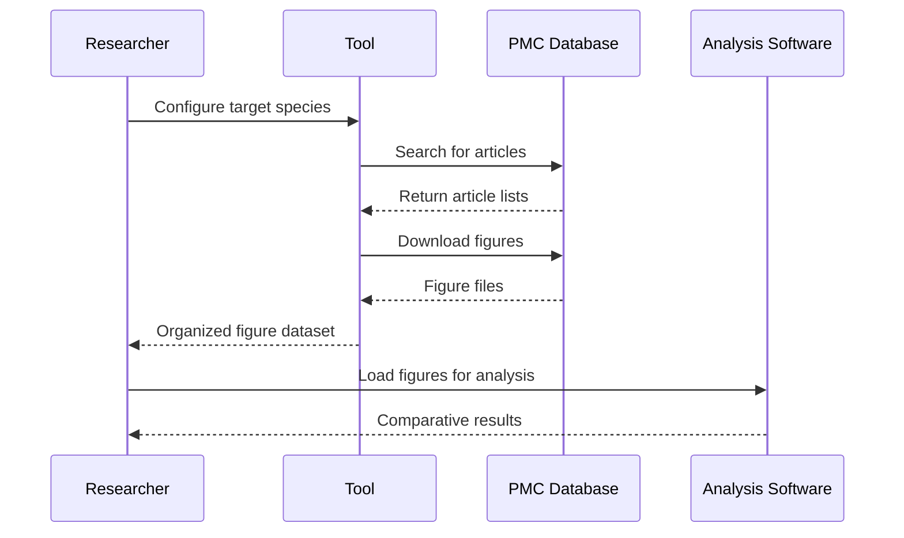

# Usage Guide

## Quick Start

This guide provides step-by-step instructions for using the Publication Figure Retrieval Tool, from basic installation to advanced configuration options.

## Prerequisites

Before you begin, ensure your system meets the following requirements:

- **Node.js**: Version 20 or higher
- **RAM**: Minimum 4GB available
- **Internet**: Stable connection with 7+ Mbps download speed

## Installation

### 1. Clone the Repository

```bash
git clone https://github.com/AlexJSully/Publication-Figure-Retrieval.git
cd Publication-Figure-Retrieval
```

### 2. Install Dependencies

```bash
# Install all dependencies
npm ci
```

### 3. Verify Installation

```bash
# Run tests to verify everything is working
npm test

# Validate
npm run validate

# Build the project
npm run build
```

Expect no errors.

## Basic Usage

### Running the Tool

```bash
# Start the figure retrieval process
npm run start
```

The tool will:

1. **Load species configuration** from [`src/data/species.json`](../../src/data/species.json)
2. **Initialize rate limiting** (3 requests/second without API key)
3. **Process each species** sequentially
4. **Download article packages and extract images** into `build/output/[species]/[pmcid]/` (see [`src/processor/parseFigures.ts`](../../src/processor/parseFigures.ts) and [`src/processor/downloadArticlePackage.ts`](../../src/processor/downloadArticlePackage.ts))
5. **Cache progress** for resume capability

### Example Output

```bash
Searching articles for the species: Arabidopsis_thaliana...
Found 1,247 articles for Arabidopsis_thaliana
Fetching Arabidopsis thaliana article details for batch 1-50...
Processing article PMC ID: PMC123456
Fetching package URL for PMC123456...
Downloading package from https://.../PMC123456.tar.gz
Package downloaded. Extracting images...
Extracted image: figure1.jpg (priority: jpg)
Extracted image: figure2.png (priority: png)
Successfully extracted 2 images from package.
Successfully processed article package for PMC123456
```

## Configuration Options

### Environment Variables

Create a `.env` file in the project root:

```bash
# Optional: NCBI API key for faster processing
NCBI_API_KEY=your_api_key_here
```

### API Key Configuration

#### Getting an NCBI API Key

1. Visit [NCBI API Key Registration](https://ncbiinsights.ncbi.nlm.nih.gov/2017/11/02/new-api-keys-for-the-e-utilities/)
2. Follow the registration process
3. Add your key to `.env` file

#### Benefits of Using an API Key

| Feature                | Without API Key   | With API Key       |
| ---------------------- | ----------------- | ------------------ |
| Rate Limit             | 3 requests/second | 10 requests/second |
| Processing Speed       | ~3x slower        | ~3x faster         |
| Large Dataset Handling | Limited           | Better performance |

### Species Configuration

Edit `src/data/species.json` to customize which species to process:

```json
{
	"Arabidopsis_thaliana": {
		"alias": ["Arabidopsis thaliana", "Mouse-ear cress", "Thale cress"]
	},
	"Cannabis_sativa": {
		"alias": ["Cannabis sativa", "Hemp", "Marijuana"]
	},
	"Custom_species": {
		"alias": ["Scientific name", "Common name 1", "Common name 2"]
	}
}
```

## Common Use Cases

### 1. Download Figures for Specific Species

**Scenario**: You need figures for a particular research organism.

```bash
# Edit src/data/species.json to include only your target species
{
  "Homo_sapiens": {
    "alias": ["Homo sapiens", "Human", "Humans"]
  }
}

# Run the tool
npm run start
```

**Expected Results**:

```text
build/output/
└── Homo_sapiens/
    ├── PMC123456/
    │   ├── figure1.jpg
    │   └── figure2.png
    └── PMC789012/
        └── figure1.jpg
```

### 2. Resume Interrupted Downloads

**Scenario**: The process was interrupted and you want to continue.

```bash
# Simply run the tool again - it will resume automatically
npm run start
```

The tool automatically:

- Reads the cache file (`build/output/cache/id.json`)
- Skips already processed PMC IDs
- Continues from where it left off

### 3. Process Large Species Lists

**Scenario**: You want to download figures for many species (research dataset creation).

```bash
# The tool processes species sequentially to respect API limits
# For large lists, consider running overnight or over weekends
npm run start

# Monitor progress in real-time
tail -f output.log  # If you redirect output to a log file
```

**Performance Estimation**:

- Without API key: ~1,000 articles per hour
- With API key: ~3,000 articles per hour
- Varies based on number of figures per article

## Workflow Examples

### Research Dataset Creation



**Step-by-step**:

1. **Plan your research**: Determine which species are relevant
2. **Configure species list**: Edit `src/data/species.json`
3. **Set up environment**: Add API key to `.env`
4. **Start processing**: Run `npm run start`
5. **Monitor progress**: Watch console output
6. **Verify results**: Check `build/output/` directory structure
7. **Analyze data**: Use downloaded figures for research

### Comparative Analysis Workflow



### Batch Processing Workflow

For processing multiple research projects:

```bash
#!/bin/bash
# batch_process.sh

# Project 1: Plant species
echo "Processing plant species..."
cp configs/plant_species.json src/data/species.json
npm run start
mv build/output build/output_plants

# Project 2: Animal species
echo "Processing animal species..."
cp configs/animal_species.json src/data/species.json
npm run start
mv build/output build/output_animals

echo "Batch processing complete!"
```

## Performance Optimization

### Memory Management

```bash
# Monitor memory usage during processing
# Large species lists may require memory monitoring

# For very large datasets, process in smaller batches
node --max-old-space-size=8192 build/index.js
```

### Storage Considerations

```bash
# Estimate storage requirements
# Typical figure: 100KB - 2MB
# 1000 articles × 2 figures × 500KB = ~1GB

# Monitor disk space during processing
df -h build/output/
```

## Monitoring and Troubleshooting

### Progress Monitoring

```bash
# Count processed articles
find build/output -name "PMC*" -type d | wc -l

# Count downloaded figures
find build/output -name "*.jpg" -o -name "*.png" | wc -l

# Check cache status
cat build/output/cache/id.json | jq length
```

## Next Steps

- [API Documentation](./api/index.md) - Detailed function and module references
- [Contributing](../../CONTRIBUTING.md) - How to extend and modify the tool
- [FAQ](../faq.md) - Common questions and advanced troubleshooting
